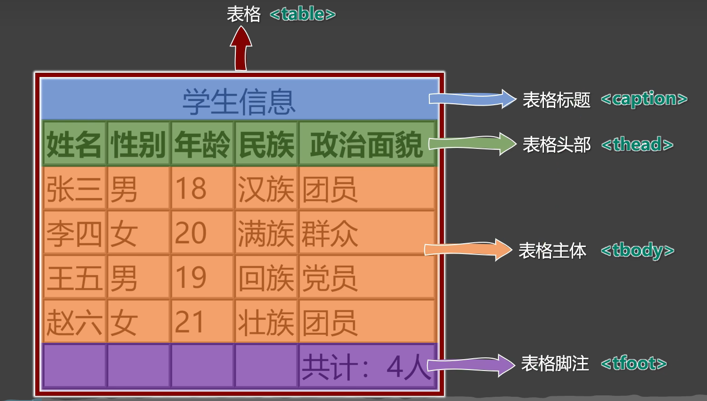
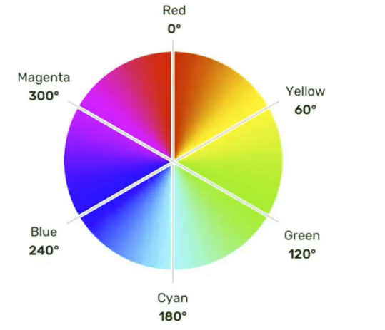
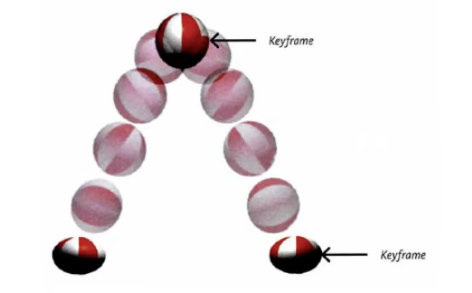

# frontend-html-css-learning

[TOC]

前端三件套：

https://www.bilibili.com/read/cv5650633

https://www.bilibili.com/video/BV1p84y1P7Z5/?p=197&spm_id_from=pageDriver&vd_source=b850b3a29a70c8eb888ce7dff776a5d1

# 一、HTML4

## 1、HTML基本概念

### 1.1、HTML是什么？

全称：HyperText Markup Language

译为：超文本标记语言

超文本：暂且理解为“超级的文本”，和普通文本比，内容更丰富。

> 超文本：是一种组织信息的方式，通过超链接将不同空间的文字、图片、等各种信息组织在一起，能从当前阅读的内容，跳转到超链接所指向的内容。

标记：文本要变成超文本，就需要用到各种标记符号。

语言：生活中每个汉字的写法、读音、使用规则等等，构成了汉语。


- IETF
  - 全名：Internet Engineering Task Force
  - 译名：国际互联网工程任务组
  - 成立于：1985年
  - 官网：https://www.ietf.org
- W3C
  - 全名：World Wide Web Consortium
  - 译名：万维网联盟
  - 成立于：1994年
  - 官网：https://www.w3.org
- WHATWG
  - 全名：Web Hypertext Application Technology Working Group
  - 译名：网页超文本应用技术工作小组
  - 成立于：2004年
  - 官网：https://whatwg.org

### 1.2、HTML标签

1、**标签**又称**元素**，是HTML的基本组成单位。

2、标签分为：**双标签**与**单标签**（绝大多数都是双标签）。

3、标签名不区分大小写，但推荐小写，因为小写更规范。

4、双标签：

> 
>
> 示例代码：
>
> ```html
> <marquee>我爱你，让天下没有难学的技术！</marquee>
> ```

5、单标签：

> 
>
> 示例代码：
>
> ```html
> <input>
> ```

6、标签直接的关系：并列关系、嵌套关系，可以使用`tab`键进行缩进：

```html
<marquee>
	我爱你，让天喜爱没有难学的技术！
    <input>
</marquee>
```

### 1.3、HTML标签属性

1、用于给标签提供**附加信息**。

2、可以写在：**起始标签**或**单标签中**，形式如下：

> 
>
> ```html
> <marquee loop="1" bgcolor="orange">
>     我爱你，让天下没有难学的技术！<input type="password">
> </marquee>
> <input disabled>
> ```

3、有些特殊的属性，没有属性名，只有属性值，例如：

```html
<input disabled>
```

4、注意点

> 1、不同的标签，有不同的属性；也有一些通用属性（在任何标签内都能写）。
>
> 2、属性名、属性值不能乱写，都是W3C规定好的。
>
> 3、属性名、属性值，都不区分大小写，但推荐小写。
>
> 4、双引号，也可以写成单引号，甚至不写都行，但还是推荐写双引号。
>
> 5、标签中不要出现同名属性，否则后写的会失效（**后来者无立足之地**），例如：
>
> ```html
> <input type="text" type="password">
> ```

### 1.4、HTML基本结构

1、在网页中，如何查看某段结构的具体代码？——点击鼠标右键，选择“检查”。

2、【检查】和【查看网页源代码】的区别：

> 【查看网页源代码】看到的是：程序员编写的源代码。
>
> 【检查】看到的是：经过浏览器“处理”后的源代码。
>
> 备注：日常开发中，【检查】用的最多。

3、网页的**基本结构**如下：

> 1、想要呈现在网页中的内容写在`body`标签中。
>
> 2、`head`标签中的内容不会出现在网页中。
>
> 3、`head`标签中的`title`标签可以指定网页的标题。
>
> 4、图示
>
> ```html
> <!DOCTYPE html>
> <html lang="en">
>     <head>
>     	......
>     </head>
>     <body>
>         ......
>     </body>
> </html>
> ```
>

### 1.5、HTML注释

1、特点：注释的内容会被浏览器所忽略，不会呈现到页面中，但源代码中依然可见。

2、作用：对代码进行解释和说明。

3、写法：

```html
    <!-- 下面的输入框是可以滚动的，且只能滚动一次 -->
    <marquee loop="1">
        我爱你
        <input type="text">
    </marquee>
    <!-- 下面的输入框是不可以滚动的 -->
    <input type="text">
```

4、注释不可用嵌套，以下写法错误（反例）

```html
<!--
	我是一段注释
	<!-- 我是一段注释 -->
-->
```

### 1.6、HTML文档声明

1、作用：告诉浏览器当前网页的版本。

2、写法：

- 旧的写法：需要依赖网页所用的HTML版本而定，写法有很多。

  > 具体有哪些写法，请参考：[W3C官网-文档声明](https://www.w3.org/QA/2002/04/valid-dtd-list.html)

- 新的写法：一切都变得简单了！W3C推荐使用HTML5的写法。

```html
<!DOCTYPE html>
或
<!DOCTYPE HTML>
或
<!doctypye html>
```

3、注意：文档声明，必须在网页的第一行，且在`html`标签的外侧。

### 1.7、字符编码

ASCII => 大写字母、小写字母、数字、一些符号，共计 128 个。

ISO 8859-1 => 在ASCII基础上，扩充了一些希腊字符等，共计是 256 个。

GB2312 => 继续扩充，收录了 6763 个常用汉字、682 个字符。

GBK => 收录了的汉字和符号达到 20000+，支持繁体中文。

UTF-8 => 万国码，包含世界上所有语言的：所有文字与符号。—— 很常用。

```html
<head>
    <meta charset="UTF-8">
    <title>Title</title>
</head>
```

### 1.8、设置语言

1、主要作用：

- 让浏览器显示对应的翻译提示。
- 有利于搜索引擎优化。

2、具体写法：

```html
<html lang="zh-CN">
    
</html>
```

3、扩展只是：`lang`属性的编写规则

> 1、第一种写法（语言-国家/地区）
>
> - zh-CN : 中文-中国大陆（简体中文）
> - zh-TW : 中文-中国台湾（繁体中文）
> - zh : 中文
> - en-US : 英语-美国
> - en-GB : 英语-英国
> - en : 英语
>
> 2、第二种写法（语言-具体种类）已不推荐使用，例如：
>
> - zh-Hans : 中文-简体
> - zh-Hant : 中文-繁体
>
> 3、W3School上的说明：[语言代码参考手册](https://www.w3school.com.cn/tags/html_ref_language_codes.asp) [国家/地区代码参考手册](https://www.w3school.com.cn/tags/html_ref_country_codes.asp) 
>
> 4、W3C官网上的说明： [Language in HTML](https://www.w3.org/International/articles/language-tags/)

### 1.9、HTML标准结构

可以通过Emmet提示，输入`!`得到。

```html
<!DOCTYPE html>
<html lang="zh-CN">

<head>
    <meta charset="UTF-8">
    <title>Document</title>
</head>

<body>
    <input type="text">
</body>

</html>
```

## 2、HTML详解

### 2.1、HTML开发者文档

- W3C官网：https://www.w3.org/
- W3School：https://w3school.com.cn
- MDN：https://developer.mozilla.org 【推荐】

### 2.2、HTML排版标签

| 标签名 | 标签语义                                       | 单/双标签 | 元素类型 |
| ------ | ---------------------------------------------- | --------- | -------- |
| h1~h6  | 标题                                           | 双        | 块级元素 |
| p      | 段落                                           | 双        | 块级元素 |
| div    | 没有任何含义，用于正题布局（生活中的包装袋）。 | 双        | 块级元素 |

1）`h1`最好写一个，`h2~h6`能适当多写。

2）`h1~h6`不能互相嵌套，例如：`h1`标签中最好不要写`h2`标签了。

3）`p`标签很特殊！它里面不能有：`h1~h6`、`p`、`div`标签。

### 2.3、HTML语义化标签

语义化：标签默认的效果不重要，语义最重要！

- 概念：用特定的标签，去表达特定的含义。

- 原则：标签的默认效果不重要（后期可以通过CSS随便控制效果），语义最重要！

- 举例：对于h1标签，效果是文字很大（不重要），语义是网页主要内容（很重要）

- 优势：

  - 代码结构清晰可读性强。
  - 有利于SEO（Search Enging Optimization - 搜索引擎优化） 爬虫 代码 机器人
  - 方便设备解析（屏幕阅读器、盲人阅读器）

  >如果有一天你想结婚了，最好不是因为年龄到了，而是爱情来了！
  >
  >如果有一天你想用h1了，最好不是因为它的默认效果，而是它的语义——网页主要内容
  >
  >如果有一天你想用p了，最好不是因为它的默认效果，而是它的语义——段落解析（屏幕阅读器、盲人阅读器）

### 2.4、块级元素与行内元素

1、**块级元素**：独占一行（排版标签都是块级元素）

2、**行内元素**：不独占一行。

3、**使用规则**：

> 1、**块级元素**中能写**行内元素**和**块级元素**（简单记：块级元素中几乎什么都能写）。
>
> 2、**行内元素**中能写**行内元素**，但不能写**块级元素**。
>
> 3、一些特殊的规则：
>
> - h1~h6 不能互相嵌套。
> - p中不要写块级元素。

4、备注说明

> marquee元素设计的初衷是：让文字有动画效果，但如今我们可以通过CSS来实现了，而且还可以实现的更加炫酷，所以marquee标签已经过时了，不推荐使用。

### 2.5、文本标签

1、用于包裹：词汇、短语等。

2、通常写在排版标签里面。

3、排版标签更宏观（大段的文字），文本标签更微观（词汇、短语）。

4、文本标签通常都是行内元素。

**常用的**：

| 标签名 | 标签语义                         | 单/双标签 | 元素类型 |
| ------ | -------------------------------- | --------- | -------- |
| em     | 要着重阅读的内容                 | 双        | 行内元素 |
| strong | 十分重要的内容（语气比em要强）   | 双        | 行内元素 |
| span   | 没有语义，用于包裹短语的通用容器 | 双        | 行内元素 |

> 生活中的例子：div是大包装袋，span是小包装袋。

**不常用的**：

| 标签名     | 标签语义                                                     | 单/双标签 | 元素类型 |
| ---------- | ------------------------------------------------------------ | --------- | -------- |
| cite       | 作品标题（书籍、歌曲、电影、电视节目、绘画、雕塑）           | 双        | 行内元素 |
| dfn        | 特殊术语，或专属名词                                         | 双        | 行内元素 |
| del与ins   | 删除的文本【与】插入的文本                                   | 双        | 行内元素 |
| sub与sup   | 下标文字【与】上标文字                                       | 双        | 行内元素 |
| code       | 一段代码                                                     | 双        | 行内元素 |
| samp       | 从正常的上下文中，将某些内容提取出来，例如：标识设备输出     | 双        | 行内元素 |
| kbd        | 键盘文本，表示文本是通过键盘输入的，经常用在与计算机相关的手册中 | 双        | 行内元素 |
| abbr       | 缩写，最好配合上title属性                                    | 双        | 行内元素 |
| bdo        | 更改文本方向，要配合dir属性，可选值：ltr（默认值）、rtl      | 双        | 行内元素 |
| var        | 标记变量，可以与code标签一起使用                             | 双        | 行内元素 |
| small      | 附属细则，例如：包括版权、法律文本。——很少使用               | 双        | 行内元素 |
| b          | 摘要中的关键字、评论中的产品名称。——很少使用                 | 双        | 行内元素 |
| i          | 本意是：人物的思想活动、所说的话等等。现在多用于：呈现**字体图标** | 双        | 行内元素 |
| u          | 与正常内容有反差的文本，例如：错误的单词、不合适的描述等。——很少使用 | 双        | 行内元素 |
| q          | 短引用——很少使用                                             | 双        | 行内元素 |
| blockquote | 长引用——很少使用                                             | 双        | 块级元素 |
| address    | 地址信息                                                     | 双        | 块级元素 |

> 备注：
>
> 1、这些不常用的文本标签，编码时不用过于纠结（酌情而定，不用也没毛病）。
>
> 2、`blockquote`与`address`是块级元素，其他的文本标签，都是航安诶元素。
>
> 3、有些语义感不强的标签，我们很少使用，例如：
>
> `small`、`b`、`u`、`q`、`blockquote`
>
> 4、HTML标签太多了！记住那些：重要的、语义感强的标签即可；截止目前，有这些：
>
> `h1~h6`、`p`、`div`、`em`、`strong`、`span`

### 2.6、图片标签

| 标签名 | 标签语义 | 常用属性                                                     | 单/双标签 | 元素类型 |
| ------ | -------- | ------------------------------------------------------------ | --------- | -------- |
| img    | 图片     | src : 图片路径（又称：图片地址）<br />alt : 图片描述<br />width : 图片宽度，单位是像素，例如：200px或200<br />height : 图片高度，单位是像素，例如：200px或200 | 单        | 行内元素 |

总结：

> 1、像素（px）是一种单位。
>
> 2、尽量不同时修改图片的宽和高，可能会造成比例失调。
>
> 3、暂且认为img是行内元素（学到CSS时，会认识一个新的元素分类，目前仅知道：块、行内）
>
> 4、alt属性的作用：
>
> - 搜索引擎通过alt属性，得知图片的内容。——最主要的作用。
> - 当图片无法展示时候，有些浏览器会呈现alt属性的值。
>
> - 盲人阅读器会朗读alt属性的值。

### 2.7、常见图片格式

1、jpg格式

>概述：扩展名为`.jpg`或`.jpeg`，是一种有损的压缩格式（把肉眼不容易观察出来的细节丢弃了）。
>
>主要特点：**支持的颜色丰富**、**占用空间较小**、不支持透明背景、不支持动态图。
>
>使用场景：对图片细节**没有极高要求**的场景，例如：网站的产品宣传图等。——该格式网页中很常见。

2、png格式：

> 概述：扩展名为`.png`，是一种无损的压缩格式，能够更高质量的保存图片。
>
> 主要特点：**支持的颜色丰富**、占用空间略大、**支持透明背景**、不支持动态图。
>
> 使用场景：1）想让图片有透明背景；2）想更高质量的呈现图片；例如：公司logo图、重要配置图等。

3、bmp格式：

> 概述：扩展名为`.bmp`，不进行压缩的一种格式，在最大程度上保留图片更多的细节。
>
> 主要特点：**支持的颜色丰富**、**保留的细节更多**、占用空间极大、不支持透明背景、不支持动态图。
>
> 使用场景：对图片细节**要求极高**的场景，例如：一些大型游戏中的图片。（网页中很少使用）

4、git格式：

> 概述：扩展名为`.git`，仅支持256种颜色，色彩呈现不是很完整。
>
> 主要特点：支持的颜色较少、**支持简单透明背景、支持动态图**。
>
> 使用场景：网页中的动态图片。

5、webp格式：

> 概述：扩展名为`webp`，谷歌推出的一种格式，专门用来在网页中呈现图片。
>
> 主要特点：具备上述几种格式的优点，但兼容性不太好，一旦使用务必要解决兼容性问题。
>
> 使用场景：网页中的各种图片。

6、base64格式

> 1、本质：一串特殊的文本，要通过浏览器打开，传统看图应用通常无法打开。
>
> 2、原理：把图片进行`base64`编码，形成一串文本。
>
> 3、如何生成：靠一些工具或网站。
>
> 4、如何使用：直接作为`img`标签的src属性的值即可，并且不受文件位置的影响。
>
> 5、使用场景：一些较小的图片，或者需要和网页一起加载的图片。

**图片的格式非常多，上面这些，只是一些常见的、我们前端人员常接触到的。**

### 2.8、超链接

主要作用：从当前页面进行跳转。

| 标签名 | 标签语义 | 常用属性                                                     | 单/双标签 | 元素类型 |
| ------ | -------- | ------------------------------------------------------------ | --------- | -------- |
| a      | 超链接   | href : 要跳转的具体位置。<br />target : 跳转时如何打开页面，常用值如下：<br />_self : 在本页签中打开<br />_blank : 在新页签中打开。<br />虽然是行内元素，但可以包含行内元素、块级元素，只要不是a标签自身即可。 | 双        | 行内元素 |

> 注意点：
>
> 1、代码中的**多个空格**、**多个回车**，都会被浏览器解析成一个空格！
>
> 2、虽然a是行内元素，但a元素可以包裹除它自身外的任何元素！

### 2.9、列表

**1.有序列表**

概念：有顺序或侧重顺序的列表。

```html
    <h2>要把大象放冰箱，拢共分几步？</h2>
    <ol>
        <li>把冰箱门打开</li>
        <li>把大象放进去</li>
        <li>把冰箱门关上</li>
    </ol>
```

**2.无序列表**

概念：无顺序或不侧重顺序的列表。

```html
    <h2>我想去的几个城市</h2>
    <ul>
        <li>成都</li>
        <li>上海</li>
        <li>西安</li>
        <li>武汉</li>
    </ul>
```

**3.列表嵌套**

概念：列表汇总的某一项内容，又包含一个列表（注意：嵌套时，请务必把结构写完整）。

```html
    <h2>我想去的几个城市</h2>
    <ul>
        <li>成都</li>
        <li>
            <span>上海</span>
            <ul>
                <li>外滩</li>
                <li>
                    <span>东方明珠</span>
                    <ul>
                        <li>XXXXX</li>
                    </ul>
                </li>
                <li>迪士尼公园</li>
                <li>杜莎夫人蜡像馆</li>
            </ul>
        </li>
        <li>西安</li>
        <li>武汉</li>
    </ul>
```

> 注意：`li`标签最好写在`ul`或`ol`中，不要单独使用。

**4.自定义列表**

1、概念：所谓自定义列表，就是一个包含**术语名称**以及**术语描述**的列表。

2、一个`dl`就是一个自定义列表，一个`dt`就是一个术语名称，一个`dd`就是术语描述（可以由多个）。

```html
    <h2>如何更好的学习</h2>
    <dl>
        <dt>做好笔记</dt>
        <dd>笔记是我们以后复习的一个抓手</dd>
        <dd>笔记可以使电子版，也可以是纸质版</dd>
        <dt>多加练习</dt>
        <dd>只有敲出来的代码，才是自己的</dd>
        <dt>别怕出错</dt>
        <dd>错误真正常，改正后并记住，就是经验</dd>
    </dl>
```

### 2.10、表格

**1.基本结构**

1、一个完整的表格由：**表格标题**、**表格头部**、**表格主体**、**表格脚注**，四部分组成。



2、表格涉及到的标签：

`table`：表格

`caption`：表格标题

`thead`：表格头部

`tbody`：表格主体

`tfoot`：表格脚注

`tr`：每一行

`th`、`td`：每个单元格（备注：表格头部中用`th`，表格主体、表格脚注中用：`td`）


**2.常用属性**

| 标签名 | 标签语义   | 常用属性                                                     | 单/双标签 |
| ------ | ---------- | ------------------------------------------------------------ | --------- |
| table  | 表格       | width : 设置表格宽度。<br />height : 设置表格**最小**高度，表格最终高度可能比设置的值大<br />border : 设置表格边框宽度。<br />cellspacing : 设置单元格直接的间距。 | 双        |
| thead  | 表格头部   | height : 设置表格头部高度。<br />align : 设置单元格的水平对齐方式，可选值：<br />1-left : 左对齐；2-center : 中间对齐；3-right : 右对齐<br />valign : 设置单元格的垂直对齐方式，可选值：<br />1-top : 顶部对齐；2-middle : 中间对齐；3-bottom : 底部对齐 | 双        |
| tbody  | 表格主体   | 常用属性与 thead 相同。                                      | 双        |
| tr     | 行         | 常用属性与 thead 相同。                                      | 双        |
| tfoot  | 表格脚注   | 常用属性与 thead 相同。                                      | 双        |
| td     | 普通单元格 | width : 设置单元格的宽度，同列所有单元格全部都受影响。<br />height : 设置单元格的高度，同行所有单元格全部都受影响。<br />align : 设置单元格的水平对齐方式。<br />valign : 设置单元格的垂直对齐方式。<br />rowspan : 指定要跨的行数。<br />colspan : 指定要跨的列数。 | 双        |
| th     | 表头单元格 | 常用属性与td相同。                                           | 双        |

注意点：

> 1、`<table>`元素的border属性可以控制表格边框，但border值的大小，并不控制单元格边框的宽度，只能控制表格最外侧边框的宽度，这个问题如何解决？——CSS控制。
>
> 2、给某个th或td设置了宽度之后，他们所在的那一列的宽度就确定了。

**3.跨行跨列**

1、rowspan : 指定要跨的行数。

2、colspan : 指定要跨的列数。

### 2.11、常用标签补充

| 标签名 | 标签语义                                     | 单/双标签 | 元素类型 |
| ------ | -------------------------------------------- | --------- | -------- |
| br     | 换行                                         | 单        | 块级元素 |
| hr     | 分割                                         | 单        | 块级元素 |
| pre    | 按照原文显示（一般用于在页面中嵌入大段代码） | 双        | 块级元素 |

> 注意点：
>
> 1、不要用`<br>`来增加文本之间的行间隔，应使后面即将学到的CSS margin属性。
>
> 2、`<hr`的语义是分割，如果不想要语义，只是想画一套水平线，那么应当使用CSS完成。

### 2.12、表单

**1.基本结构**

简单梳理：

| 标签名   | 标签语义         | 常用属性                                                     | 单/双标签 |
| -------- | ---------------- | ------------------------------------------------------------ | --------- |
| form     | 表单             | action : 用于指定表单的提交地址（需要与后端人员沟通后确定）。<br />target : 用于控制表单提交后如何打开页面：_self : 本窗口打开； _blank : 新窗口打开。<br />method : 用于控制表单的提交方式，暂时只需了解，在后面 Ajax 的课程中，会详细讲解。 | 双        |
| input    | 输入框           | type 属性：指定表单控件的类型。<br />可选值：text\|password\|radio\|checkbox\|hidden\|submit\|reset\|button等。<br />name 属性：指定数据名称。<br />value 属性：对于输入框：指定默认输入的值；对于单选和复选框：实际提交的数据；对于按钮：显示的按钮文字。<br />disabled 属性：设置表单控件不可用。<br />maxlength 属性：用于输入框，设置最大可输入长度。<br />checked 属性：用于单选按钮和复选框，默认选中。 | 单        |
| textarea | 文本域           | name 属性：指定数据名称。<br />rows 属性：指定默认显示的行数，影响文本域的高度。<br />cols 属性：指定默认显示的列数，影响文本域的宽度。<br />disabled 属性：设置表单控件不可用。 | 双        |
| select   | 下拉框           | name 属性：指定数据名称。<br />disabled 属性：设置整个下拉框不可用。 | 双        |
| option   | 下拉框选项       | disabled 属性：设置下拉框选项不可用。<br />value 属性：该选项事件提交的数据（不指定value，会把标签中的内容作为提交数据） | 双        |
| button   | 按钮             | disabled 属性：设置按钮不可用。<br />type 属性：设置按钮的类型，值：submit（默认）、reset、button | 双        |
| label    | 与表单控件做关联 | for 属性：值与要关联的表单控件的ID值相同。                   | 双        |
| fieldset | 表单控件分组     |                                                              | 双        |
| legend   | 分组名称         |                                                              | 双        |

**2.常用表单控件**

1）文本输入框

```html
<input type="text">
```

> 常用属性如下：
>
> name 属性：数据的名称。
>
> value 属性：输入框的默认输入值。
>
> maxlength 属性：输入框最大可输入长度。

2）密码输入框

```html
<input type="password">
```

> 常用属性如下：
>
> name 属性：数据的名称。
>
> value 属性：输入框的默认输入值（一般不用，无意义）。
>
> maxlength 属性：输入框最大可输入长度。

**3.单选框**

```html
<input type="radio" name="gender" value="male">男
<input type="radio" name="gender" value="female" checked>女<br>
```

> 常用属性如下：
>
> name 属性：数据的名称，注意：想要单选效果，多个radio的name属性值要保持一致。
>
> value 属性：提交的数据值。
>
> checked 属性：让该单圈按钮默认选中。

**4.复选框**

```html
<input type="checkbox" name="hobby" value="smoke" checked>抽烟
<input type="checkbox" name="hobby" value="drink">喝酒
<input type="checkbox" name="hobby" value="perm" checked>烫头<br>
```

> 常用属性如下：
>
> name 属性：数据的名称。
>
> value 属性：提交的数据值。
>
> checked 属性：让该复选框默认选中。

**5.隐藏域**

```html
<input type="hidden" name="tag" value="180">
```

> 用户不可见的一个输入区域，作用是：提交表单的时候，携带一些固定的数据。
>
> name 属性：指定数据的名称。
>
> value 属性：指定的是真正提交的数据。

**6.提交按钮**

```html
<input type="submit" value="点我提交表单">
<button>点我提交表单</button>
```

> 注意：
>
> 1、button 标签 type 属性的默认值是 submit。
>
> 2、button 不要指定 name 属性。
>
> 3、input 标签编写的按钮，使用 value 属性指定按钮文字。

**7.重置按钮**

```html
<input type="reset" value="点我重置">
<button type="reset">点我重置</button>
```

> 注意点：
>
> 1、button 不要指定 name 属性。
>
> 2、input 标签编写的按钮，使用 value 属性指定按钮文字。

**8.普通按钮**

```html
<input type="button" value="普通按钮">
<button type="button">普通按钮</button>
```

> 注意点：普通按钮的 type 值为 button，若不写 type 值是 submit 会引起表单的提交。

**9.文本域**

```html
<textarea name="msg" rows="22" cols="3">我是文本域</textarea>
```

> 常用属性如下：
>
> 1、rows 属性：指定默认显示的行数，会影响文本域的高度。
>
> 2、cols 属性：指定默认显示的列数，会影响文本域的宽度。
>
> 3、不能编写 type 属性，其他属性，与普通文本输入框一致。

**10下拉框**

```html
<select name="from">
    <option value="黑">黑龙江</option>
    <option value="辽">辽宁</option>
    <option value="吉">吉林</option>
    <option value="粤">广东</option>
</select>
```

> 常用属性即注意事项：
>
> 1、name 属性：指定数据的名称。
>
> 2、option 标签设置 value 属性，如果没有 value 属性，提交的数据是 option 中间的文字；如果设置了 value 属性，提交的数据就是 value 的值（建议设置 value 属性）。
>
> 3、option 标签设置了 selected 属性，表示默认选中。

**11.禁用表单控件**

给表单控件的标签设置 disabled 即可禁用表单控件。

> input|textarea|button|select|option 都可以设置 disabled 属性。

**12.label标签**

label 标签可与表单控件相关联，关联之后点击文字，与之对应的表单控件就会获取焦点。

两种与 label 关联的方式如下：

1、让 label 标签的 for 属性的值等于表单控件的 id。

2、把表单控件套在 label 标签的里面。

### 2.13.框架标签

| 标签名 | 标签语义                     | 常用属性                                                     | 单/双标签 | 元素类型 |
| ------ | ---------------------------- | ------------------------------------------------------------ | --------- | -------- |
| iframe | 框架（在网页中嵌入其他文件） | name : 框架名字，可以与 target 属性配合。<br />width : 框架的宽。<br />height : 框架的高度。<br />frameborder : 是否显示边框，值：0或者1. | 双        | 行内元素 |

> iframe 标签的实际应用：
>
> 1、在网页中嵌入广告。
>
> 2、与超链接或表单的 target 配合，展示不同的内容。

### 2.14、HTML字符实体

在 HTML 中我们可以用一种**特殊的形式**的内容，来标识某个**符号**，这种特殊形式的内容，就是**HTML**实体。比如小于号`<`用于定义 HTML 标签的开始。如果我们希望浏览器正确地显示这些字符，我们必须在 HTML 源码中插入字符实体。

> 字符实体由三部分组成：一个 `&` 和一个实体名称（或者一个 `#` 和一个实体编号），最好加上一个分号`;`。

| 字符 | 说明              | 实体名     | 实体编号  |
| ---- | ----------------- | ---------- | --------- |
| ` `  | 空格              | `&nbsp;`   | `&#160;`  |
| <    | 小于号            | `&lt;`     | `&#60;`   |
| >    | 大于号            | `&gt;`     | `&#62;`   |
| &    | 和号              | `&amp;`    | `&#38;`   |
| "    | 引号              | `&quot;`   | `&#34;`   |
| `    | 反引号            | `&acute;`  | `&#180;`  |
| ¢    | 分（cent）        | `&cent;`   | `&#162;`  |
| £    | 镑（pound）       | `&pound;`  | `&#163;`  |
| ¥    | 元（yen）         | `&yen;`    | `&#165;`  |
| €    | 欧元（euro）      | `&euro;`   | `&#8364;` |
| ©    | 版权（copyright） | `&copy;`   | `&#169;`  |
| ®    | 注册商标          | `&reg;`    | `&#174;`  |
| ™    | 商标              | `&trade;`  | `&#8482;` |
| ×    | 乘号              | `&times;`  | `&#215;`  |
| ÷    | 除号              | `&divide;` | `&#247;`  |

[字符实体官方列表](https://html.spec.whatwg.org/multipage/named-characters.html#named-character-references)

### 2.15、HTML全局属性

常用的全局属性：

| 属性名 | 含义                                                         |
| ------ | ------------------------------------------------------------ |
| id     | 给标签指定唯一标识，注意：id 是不能重复的。<br />作用：可以让 label 标签与表单控件相关联；也可以与 CSS、JavaScript 配合使用。<br />注意：不能在以下 HTML 元素中使用：<br />`<head>`、`<html>`、`<meta>`、`<script>`、`<style>`、`<title>`。 |
| class  | 给标签指定类名，随后通过 CSS 就可以给标签设置样式。          |
| style  | 给标签设置 CSS 样式。                                        |
| dir    | 内容的方向，值：`ltr`、`trl`。<br />注意：不能在以下 HTML 元素周转那个使用：<br />`<head>`、`<html>`、`<meta>`、`<script>`、`<style>`、`<title>`。 |
| title  | 给标签设置一个文字提示，一般超链接和图片用的比较多。         |
| lang   | 给标签指定语言，具体规范和可选值请参考【8.HTML设置语言】<br />注意：不能在以下 HTML 元素中使用：<br />`<head>`、`<html>`、`<meta>`、`<script>`、`<style>`、`<title>`。 |

### 2.16、meta元信息

1、配置字符编码

```html
<meta charset="UTF-8">
```

2、针对 IE 浏览器的兼容性配置

```html
<meta http-equiv="X-UA-Compatible" content="IE=edge">
```

3、针对移动端的配置

```html
<meta name="viewport" content="width=device-width, initial-scale=1.0">
```

4、配置网页关键字

```html
<meta name="keywords" content="8-12个以英文逗号隔开的单词/词语">
```

5、配置网页貌似信息

```html
<meta name="description" content="80字以内的一段话，与网站内容相关">
```

6、针对收缩引擎爬虫配置

```html
<meta name="robots" content="此处可选值键下表">
```

| 值        | 描述                               |
| --------- | ---------------------------------- |
| index     | 允许搜索爬虫索引此页面。           |
| noindex   | 要求搜索爬虫不索引此页面。         |
| follow    | 允许搜索爬虫跟随此页面上的链接。   |
| nofollow  | 要求搜索爬虫不跟随此页面上的链接。 |
| all       | 与 index, follow 等价              |
| none      | 与 noindex, nofollow 等价          |
| noarchive | 要求搜索引擎不缓存页面内容         |
| nocache   | noarchive 的替代名称。             |

7、配置网页作者

```html
<meta name="author" content="tony">
```

8、配置网页生成工具

```html
<meta name=generator" content="Visual Studio Code">
```

9、配置定义网页版权信息

```html
<meta name="copyright" content="2023-2027©版权所有">
```

10、配置网页自动刷新

```html
<meta http-equiv="refresh" content="10;url=http://www.baidu.com">
```

[文档级元数据元素](https://developer.mozilla.org/zh-CN/docs/Web/HTML/Element/meta)


# 二、CSS2

## 1、CSS基础知识

### 1.1、CSS基础


CSS（Cascading Style Sheets） 层叠样式表，也是一种标记语言，用于给 HTML 结构设置样式，例如：文字大小、颜色、元素宽高等。

- 层叠：一层一层“涂”上去。
- 样式：文字大小、背景颜色、元素宽高等等。
- 表：列表，CSS属性:值的列表。

### 1.2、CSS的编写位置

#### 1.2.1、行内样式

- 写在标签的 style 属性中，（又称：内联样式）。
- 语法：

```html
<h1 style="color:red;font-size:60px;">欢迎来到尚硅谷学习！</h1>
```

- 注意点：

> 1、style 属性的值不能随便写，写要符合CSS语法规范，既是：`名:值;`的形式。
>
> 2、行内样式表，只能控制当前标签的样式，对其他标签无效。

- 存在的问题：

> 书写繁琐、样式不能复用、并且没有提现出：**结构与样式分离**的思想，不推荐大量使用，最有对当前元素添加简单样式时，才偶尔使用。

#### 1.2.2、内部样式

- 写在 html 页面内部，将所有的 CSS 代码提取出来，单独放在 `<style>`标签中。
- 语法：

```html
<style>
    h1 {
        color: red;
        font-size: 40px;
    }
</style>
```

- 注意点：

> 1、`<style>`标签理论上可以放在 HTML 文档的任何地方，但一般都放在`<htead>`标签中。
>
> 2、此种写法：样式可以复用、代码结构清晰。

- 存在的问题：

> 1、并没有实现：结构与样式完全分离。
>
> 2、多个HTML页面无法复用样式。

#### 1.2.3、外部样式

- 写在单独的.css文件中，随后在HTML文件中引入使用。

- 语法：

  - 新建一个扩展名为.css的样式文件，把所有CSS代码都放入此文件中。

  ```css
  h1 {
  	color: red;
  	font-size: 40px;
  }
  ```

  - 在HTML文件中引入.css文件。

  ```html
  <link rel="stylesheet" href="style.css">
  ```

- 注意点：

> 1、`<link>`标签要写在`<head>`标签中。
>
> 2、`<link>`标签属性说明：
>
> - href : 引入的文档来自于哪里。
> - rel : (relation:关系)说明引入的文档与当前文档之间的关系。
>
> 3、外部样式的优势：样式可以复用、结构清晰、可触发浏览器的缓存机制，提高访问速度，实现了**结构与样式的完全分离**。
>
> 4、实际开发中，**机会都使用外部样式**，这是**最推荐的使用方式！**

### 1.3、样式表的优先级

- 优先级规则：行内样式 > 内部样式 = 外部样式

> 1、内部样式、外部样式，这二者的优先级相同，且：后面的 会覆盖 前面的（简记：”后来者居上”）。
>
> 2、同一个样式表中，优先级也和编写顺序有关，且：后面的 会覆盖 前面的（简记：”后来者居上”）。

| 分类     | 有点                                                         | 缺点                                                         | 使用频率 | 作用范围 |
| -------- | ------------------------------------------------------------ | ------------------------------------------------------------ | -------- | -------- |
| 行内样式 | 优先级最高                                                   | 1、结构与样式未分离<br />2、代码结构混乱<br />3、样式不能复用 | 很低     | 当前标签 |
| 内部样式 | 1、样式可复用<br />2、代码结构清晰                           | 1、结构与样式未彻底分离<br />2、样式不能多也难复用           | 一般     | 当前页面 |
| 外部样式 | 1、样式可多页面复用<br />2、代码结构清晰<br />3、可触发浏览器的缓存机制<br />4、结构与样式彻底分离 | 需要引入才能使用                                             | **最高** | 多个页面 |

### 1.4、CSS语法规范

CSS 语法由两部分构成：

- 选择器：找到要添加样式的元素。
- 声明块：设置具体的样式（声明块是由一个或多个声明组成的），声明的格式为：`属性名: 属性值;`

> 备注1：最好一个声明后的分号理论上能省略，但最好还是写上。
>
> 备注2：选择器与声明块之间，属性名与属性值之间，均有一个空格，理论上能省略，但最好还是写上。


- 注释的写法：

```css
/* 给所有的h1加样式 */
h1 {
    /* 字体颜色为蓝色 */
    color: blue;
    font-size: 40px;
}
```

### 1.5、CSS代码风格

- 展开风格——开发时推荐，便于维护和调试

```css
h1 {
    color: red;
    font-size: 40px;
}
```

- 紧凑风格——项目上线时推荐，可减小文件体积。

```css
h1{color:red;font-size:40px;}
```

- 备注：

> 项目上线时，我们会通过工具将【展开风格】的代码，变成【紧凑风格】，这样可以减小文件体积，节约网络浏览，同时也能让用户打开网页时速度更快。

## 2、CSS基本选择器

基本选择器包括：

1）通配选择器

2）元素选择器

3）类选择器

4）id选择器

### 2.1、通配选择器

- 作用：可以选中所有的HTML元素。
- 语法：

```css
* {
    属性名: 属性值;
}
```

- 举例：

```css
* {
    /* 选中所有元素 */
    color: orange;
    font-size: 40px;
}
```

> 备注：目前来看通配选择器貌似有点鸡肋，但后面清除样式时，会对我们有很大的帮助，后面会详细讲。

### 2.2、元素选择器

- 作用：为页面中**某种元素**统一设置样式。
- 语法：

```css
标签名 {
    属性名: 属性值;
}
```

- 举例：

```css
/* 选中所有h1元素 */
h1 {
    color: organce;
    font-size: 40px;
}
/* 选中所有p元素 */
p {
    color: blue;
    font-size: 60px;
}
```

- 备注：元素选择器无法实现**差异化设置**，例如上面的代码中，所有的`p`元素效果都一样 。

### 2.3、类选择器

- 作用：根据元素的 class 值，来选中某些元素。

> class 翻译过来有：种类、类别的含义，所以 class 值，又称：类名。

- 语法

```css
.类名 {
    属性名: 属性值;
}
```

- 举例

```css
/* 选中页面中所有类名为 speak 的元素 */
.speak {
    color: red;
}
/* 选中页面中所有类名为 answer 的元素 */
.answer {
    color: blue;
}
```

- 注意点：

1）元素的 class 属性值不带 `.`，但 CSS 的类选择器要带 `.`。

2）class 值，是我们自定义的，按照标准：不要使用纯数字、不要使用中文、尽量使用英文与数字的组合，若由多个单词组成，使用 `-` 做连接，例如：`left-menu`，且命名要有意义，做到”见名知意”。

3）一个元素不能写多个 class 属性，下面是**错误示例**：

```html
<!-- 该写法错误，元素的属性不能重复，后面的会失效 -->
<h1 class="speak" class="big">你好啊</h1>
```

4）一个元素的 class 属性，能写多个值，要用空格隔开，例如：

```html
<!-- 该写法正确，class属性，能写多个值 -->
<h1 class="speak big">你好啊</h1>
```

### 2.4、ID选择器

- 作用：根据元素的 id 属性值，来**精准的**选中**某个**元素。
- 语法：

```css
#id值 {
    属性名: 属性值;
}
```

- 举例：

```css
/* 选中id值为earthy的那个元素 */
#earthy {
    color: red;
    font-size: 60px;
}
```

- 注意：
  - id 属性值：尽量由**字母**、**数字**、**下划线（_）**、**短杠（-）**组成，最好以字母开头、不要包含空格、区分大小写。
  - 一个元素只能拥有一个 id 属性，多个元素的 id 属性值不能相同。
  - 一个元素可以同时拥有 id 和 class 属性。

### 2.5、基本选择器总结

| 选择器     | 特点                                                | 用法                   |
| ---------- | --------------------------------------------------- | ---------------------- |
| 通配选择器 | 选中所有标签，一般用于清除样式。                    | `* {color: red;}`      |
| 元素选择器 | 选中所有同种标签，但是不能差异化选择。              | `h1 {color: red;}`     |
| 类选择器   | 选中所有特定类名（`class`值）的元素——使用频率很高。 | `.say {color: red;}`   |
| ID选择器   | 选中特定 `id` 值的那个元素（唯一的）。              | `#earthy {color:red;}` |

## 3、复合选择器

### 3.1、交集选择器

- 作用：选中**同时符合**多个条件的元素。

> 交集有**并且**的含义（通俗理解：**既......又......**的意思），例如：年轻**且**长得帅。

- 语法：<span style="color:red">选择器1</span><span style="color:blue">选择器2</span><span style="color:orange">选择器3</span>...<span style="color:green">选择器n</span> {}

- 举例：

```css
/* 选中：类名为beauty的p元素，为此种写法用的非常多！！！！！ */
p.beauty {
    color: blue;
}
/* 选中：类名包含rich和beauth的元素 */
.rich.beauty {
    color: green;
}
```

- 注意：

1）有标签名，标签名必须写在前面。

2）id 选择器、理论上可以作为交集的条件，但实际应用中几乎不用——因为没有意义。

3）交集选择器中不可能出现两个元素选择器，因为一个元素，不可能既是p元素又是span元素。

4）用的最多的交集选择器是：元素选择器配合类名选择器，例如：`p.beauty`。

### 3.2、并集选择器

- 作用：选中多个选择器对应的元素，又称：**分组选择器**。

- > 所谓并集就是**或者**的含义（通俗理解：**要么**......**要么**......的意思），例如：给我转10万块钱**或者**我报警。

- 语法：<span style="color:red">选择器1,</span><span style="color:blue">选择器2,</span><span style="color:orange">选择器3,</span>...<span style="color:green">选择器n</span> {}

- 举例：

```css
/* 选中：id为peiqi，或者类名为rich，或者类名为beauty的元素 */
#peiqi,
.rich,
.beauty {
    font-size: 40px;
    background-color: gray;
    width: 200px;
}
```

- 注意：

1）并集选择器，我们一般竖着写。

2）任何形式的选择器，都可以作为并集选择器的一部分。

3）并集选择器，通常用于集体声，可以缩小样式表体积。

### 3.4、CSS_HTML元素间的关系

- 父元素：**直接**包裹某个元素的元素，就是该被包裹元素的父元素。


- 子元素：被父元素**直接**包含的元素（简记：儿子元素）。


- 祖先元素：父亲的父亲......，一直往外找，都是祖先。

> 备注：父元素，也算是祖先元素的一种。
>
> 例如：张三的父亲，也算是张三的祖先，但一般还是称呼：父亲。


- 后代元素：儿子的儿子......，一直往里找，都是后代。

> 备注：子元素，也算是后代元素的一种。
>
> 例如：张三的儿子，也算是张三的后代，但一般还是称呼：儿子。


- 兄弟元素：具有相同父元素的元素，互为兄弟元素。


### 3.5、后代选择器

- 作用：选中指定元素中，符合要求的后代元素。
- 语法：<span style="color:red">选择器1 </span><span style="color:blue">选择器2 </span><span style="color:orange">选择器3 </span>...<span style="color:green">选择器n</span> {} （先写祖先，再写后代）

> 选择器直接，用空格隔开，空格可以理解为："xxx中的"，其实就是后代的意思。
>
> 选择器123......n，可以使我们之前学习过的任何一种选择器（比如：类选择器、交集选择器等）。

- 举例：

```css
/* 选中ul中的所有li后代 */
ul li {
    color: red;
}

/* 选中ul中的所有li后代中的a */
ul li a {
    color: orange;
}

/* 选中类名为subject元素中的所有li后代 */
.subject li {
    color: blue;
}

/* 选中类名为subject元素中的所有类名为front-end的li后代 */
.subject li.front-end {
    color: blue;
}
```

- 注意：

1）后代选择器，最终选择的是后代，不选中祖先。

2）儿子、孙子、重孙子，都算是后代。

3）**结构一定要符合之前将的HTML嵌套要求**，例如：不能 p 中写 h1~h6。

### 3.6、子代选择器

- 作用：选中指定元素中，符合要求的子元素（儿子元素）。（先写父，再写子）

> 子代选择器又称：子元素选择器、子选择器。

- 语法：<span style="color:red">选择器1></span><span style="color:blue">选择器2></span><span style="color:orange">选择器3></span>...<span style="color:green">选择器n</span> {} （先写祖先，再写后代）

> 选择器之间，用 > 隔开， > 可以理解为：“XXX的子代”，其实就是儿子的意思。
>
> 选择器123......n，可以使我们之前学习过的任何一种选择器（比如：类选择器、交集选择器等）。

- 举例：

```css
/* div中的子代a元素 */
div>a {
	color: red;
}

/* 类名为persons的元素中的子代a元素 */
.persons>a {
	color: red;
}
```

- 注意：

1）子代选择器，最终选择的是子代，不是父级。

2）子、孙子、重孙子、重重孙子......统称后代！子就是指儿子。


### 3.7、兄弟选择器

- 相邻兄弟选择器：

  - 作用：选中指定元素后，符合条件的**相邻兄弟**元素。

  > 所谓相邻，就是紧挨着他的下一个，简记：睡在我下铺的兄弟。

  - 语法：<span style="color:red;">选择器1</span>+<span style="color:orange;">选择器2</span> {}。
  - 示例：

  ```css
  /* 选中div后相邻的兄弟p元素 */
  div+p {
      color: red;
  }
  ```
- 通用兄弟选择器：

  - 作用：选中指定元素后，符合条件的**所有兄弟**元素。（简记：睡在我下铺的所有兄弟）

  - 语法：<span style="color:red;">选择器1</span>~<span style="color:orange;">选择器2</span> {}。
  - 示例：

  ```css
  /* 选中div后的所有的兄弟p元素 */
  div~p {
      color: red;
  }
  ```

  - 注意：两种兄弟选择器，选择的是**下面**的兄弟。


### 3.8、属性选择器

- 作用：选中属性值符合一定要求的元素。

- 语法：

  - `[属性名]` 选中**具有**某个属性的元素。
  - `[属性名="值"]` 选中包含某个属性，且属性值**等于**指定值的元素。
  - `[属性名^="值"]` 选中包含某个属性，且属性值以指定的值**开头**的元素。
  - `[属性名$="值"]` 选中包含某个属性，且属性值以指定的值**结尾**的元素。
  - `[属性名*="值"]` 选择包含某个属性，属性值**包含**指定值的元素。

- 举例：

```css
/* 选中具有title属性的元素 */
div[title]{color:red;}

/* 选中具有title属性的元素，且title属性值为sgg */
div[title="sgg"]{color:red;}

/* 选中具有title属性的元素，且title属性值以s开头 */
div[title^="s"]{color:red;}

/* 选中具有title属性的元素，且title属性值以g结尾 */
div[title^="g"]{color:red;}

/* 选中具有title属性的元素，且title属性值包含g */
div[title*="g"]{color:red;}
```

### 3.9、伪类选择器

- 作用：选中特殊状态的元素。

> 如何理解“伪”？——虚假的，不是真的。
>
> 如何理解“伪类”？——像类（class），但不是类，是元素的一种特殊状态。

#### 3.9.1、动态伪类

1）`.link` 超链接**未被访问**的状态。

2）`.visited` 超链接**被访问过**的状态。

3）`.hover` 鼠标**悬停**在元素上的状态。

4）`.active` 元素**激活**的状态。

> 什么是激活？——按下鼠标不松开。
>
> 注意点：遵循LVHA的顺序，即：link、visited、hover、active。

5）`:focus`获取焦点的元素。

> 表单类元素才能使用`:focus`伪类。
>
> 当用户：点击元素、触摸元素、或通过键盘的“tab”键等方式，选择元素时，就是获得焦点。

#### 3.9.2、结构伪类

- 常用的：

1）`:first-child` 所有兄弟元素中的**第一个**

2）`:last-child` 所有兄弟元素中的**最后一个**

3）`:nth-child(n)` 所有兄弟元素中的**第n个**

4）`:first-of-type` 所有**同类型**兄弟元素中的**第一个**

5）`:last-of-type` 所有**同类型**兄弟元素中的**最后一个**

6）`:nth-of-type(n)` 所有**同类型**兄弟元素中的**第n个**

关于n的值；

>1、`0`或者`不写`：什么都选不中——几乎不用。
>
>2、`n`：选中所有子元素——几乎不用。
>
>3、`1~正无穷的整数`，选中对应序号的子元素。
>
>4、`2n `或 `even`：选中序号为偶数的子元素。
>
>5、`2n+1` 或 `odd`：选中序号为奇数的子元素。
>
>6、`-n+3`：选中前三个。

- 了解即可

1）`:nth-last-child(n)` 所有兄弟元素中的**倒数第n个**。

2）`:nth-last-of-type(n)` 所有**同类型**兄弟元素中的**倒数第n个**。

3）`:only-child` 选择没有兄弟的元素（独生子女）。

4）`:only-of-type` 选择没有**同类型**兄弟的元素。

5）`:root` 根元素。

6）`:empty` 内容为空的元素（空格也算内容）。

#### 3.9.3、否定伪类

`:not(选择器)` 排除满足括号中条件的元素。

#### 3.9.4、UI伪类

1）`:checked`被选中的复选框或单选按钮。

2）`:enable` 可用的表单元素（没有disabled属性）。

3） `:disabled` 不可用的表单元素（有disabled属性）。

#### 3.9.5、目标伪类（了解）

`:target` 选中锚点指向的元素。

#### 3.9.6、语言伪类（了解）

`:lang()` 根据指定的语言选择元素（本质是看lang属性的值）。

### 3.10、伪元素选择器

- 作用：选中元素中的一些特殊位置。

- 常用伪元素：
  - `::first-letter` 选中元素中的**第一个文字**。
  - `::first-line` 选中元素中的**第一行文字**。
  - `::selection` 选中**被鼠标选中**的内容。
  - `::placeholder` 选中输入框的**提示文字**。
  - `::before` 在元素**最开始**的位置，创建一个子元素（必须用 `content` 属性指定内容）。
  - `::after` 在元素**最后**的位置，创建一个子元素（必须用 `content` 属性指定内容）。

### 3.11、选择器的优先级

通过**不同选择器**，选中**相同的元素**，并且为**相同的样式名（比如color）**设置**不同的值**时，就发生了样式的冲突。

到底应用哪个样式，此时就需要看优先级了。

- 简单描述：

> 行内样式 > ID选择器 > 类选择器 > 元素选择器 > 通配选择器

- 详细描述

1）计算方式：每个选择器，都可以计算出一组权重，格式为：`(a,b,c)`

> - `a` : **ID** 选择器的个数。
> - `b` : **类**、**伪类**、**属性** 选择器的个数。
> - `c` : **元素**、**伪元素** 选择器的个数。
>
> 例如：
>
> | 选择器               | 权重    |
> | -------------------- | ------- |
> | ul>li                | (0,0,2) |
> | div ul>li p a span   | (0,0,6) |
> | #ssg .slogan         | (1,1,0) |
> | #sgg .slogan a       | (1,1,1) |
> | #sgg .slogan a:hover | (1,2,1) |

2）比较规则：按照**从左导游**的顺序，依次比较大小，当前位胜出后，后面的不再对比，例如：

> - (1,0,0) > (0,2,2)
> - (1,1,0) > (1,0,3)
> - (1,1,3) > (1,1,2)

3）特殊规则：

1. **行内样式**权重大于**所有选择器**。
2. <span style="color:red;">`!important`</span>权重，大于**行内样式**，大于**所有选择器**，**权重最高！**


## 4、CSS三大特性

### 4.1、层叠性

- 概念：如果发生了样式冲突，那就回根据一定的规则（选择器优先级），进行样式的层叠（覆盖）。

> 什么是样式冲突？——元素的**同一个样式名（比如：color）**，被设置了**不同的值**，这就是冲突。

### 4.2、继承性

- 概念：元素会自动拥有**其父元素**、或**其祖先元素**上所设置的**某些样式**。
- 规则：优先继承**离得近**的。
- 场景的可继承属性：

> `text-??`, `font-??`, `line-??`, `color` ......

- 备注：参照 MDN 网站，可查询属性是否可被继承

### 4.3、优先级

- 简单聊：`!important` > **行内样式** > **ID选择器** > **类选择器** > **元素选择器** > ***** > **元素的默认样式** > **继承的样式**。
- 详细聊：需要计算权重

> 计算权重时需要注意：**并集选择器的每一个部分是分开算的！**

## 5、颜色的表示

### 5.1、表示方式一：颜色名

- 编写方式：直接使用颜色对应的英文单词，编写比较简单，例如：

1. <span style="color:red;font-weight:bold;">红色：red</span>
2. <span style="color:green;font-weight:bold;">绿色：red</span>
3. <span style="color:blue;font-weight:bold;">蓝色：red</span>
4. <span style="color:purple;font-weight:bold;">紫色：red</span>
5. <span style="color:orange;font-weight:bold;">橙色：red</span>
6. <span style="color:gray;font-weight:bold;">灰色：red</span>

> 1、颜色名这种方式，表达的颜色比较单一，所以用的并不多。
>
> 2、具体颜色名参考 MDN 官方文档
>
> https://developer.mozilla.org/zh-CN/docs/Web/CSS/named-color

### 5.2、表示方式二：RGB和RGBA

- 小规律：

> 1、若三种颜色值相同，呈现的是灰色，值越大，灰色越浅。
>
> 2、rgb(0,0,0)是黑色，rgb(255,255,255)是白色。
>
> 3、对于rgba来说，前三位的rgb形式要保持一致，要么都是0~255的数字，要么都是百分比。

### 5.3、表示方式三：HEX或HEXA

HEX的原理通RGB一样，依然是通过：红、绿、蓝进行组合，只不过要用6个数字，分成3组来表达。

格式为：#rrggbb

> 每一位数字的取值范围是：0~f，即：（0,1,2,3,4,5,6,7,8,9,a,b,c,d,e,f）
>
> 所以每一种光的最小值是：00，最大值是：ff

**注意：**IE浏览器不支持HEXA，但支持HEX。

### 5.4、表达方式四：HSL与HSLA

HSL(hue-色相，saturation-饱和度，lightness-亮度)

- HSL是通过：色相、饱和度、亮度，来标识一个颜色的，格式为：`hsl(色相,饱和度,亮度）`

  - 色相：取值范围是0-360度，具体度数对应的颜色如下图：

  

  - 饱和度：取值范围是`0%~100%`。（向色相中对应颜色中添加灰色，0%全灰，100%没有灰）
  - 亮度：取值范围是`0%~100%`。（0%亮度没了，所以就是黑色。100%亮度太强，所以就是白色了）

- HSLA其实就是在HSL的基础上，添加了透明度。

## 6、CSS属性

### 6.1、CSS字体属性

**1、字体大小**

- 属性名：`font-size`
- 语法：

```css
div {
    font-size: 40px;
}
```

- 注意点：

> 1、Chrome浏览器支持的最小文字为`12px`，默认的文字大小位`16px`，并且`0px`会自动消失。
>
> 2、不同浏览器默认字体大小可能不一致，所以最好给一个明确的值，不要用默认大小。
>
> 3、通常以给`body`设置`font-size`属性，这样`body`中的其他元素就都可以继承了。

- 借助控制台看样式：


**2、字体族**

- 属性名：`font-family`
- 语法：

```css
div {
    font-size: 100px;
    font-family: "HanziPen SC", "STCaiyun", "STHupo", "Microsoft YaHei", sans-serif;
}
```

- 注意

> 1、使用字体的英文名字兼容性会更好，具体的英文名字可以自行查询，或在电脑的设置里去寻找。
>
> 2、如果字体名包含空格，必须使用引号包裹起来。
>
> 3、可以设置多个字体，按照从左到右的顺序逐个查找，找到就用，没有找到就使用后面的，且通常在最后写上`serif`（衬线字体）或`sans-serif`（非衬线字体）。
>
> 4、Windows系统中，默认的字体就是微软雅黑。

**3、字体风格**

- 属性名：`font-style`
- 常用值：
  1. `normal`：正常（默认值）
  2. `italic`：斜体（使用字体自带的斜体效果）
  3. `oblique`：斜体（强制倾斜产生的斜体效果）

> 实现斜体时，更推荐使用`italic`。

- 语法：

```css
div {
    font-style: italic;
}
```

**4、字体粗细**

- 属性名：`font-weight`
- 常用值：
  - 关键词
    1. `lighter`: 细
    2. `normal`: 正常
    3. `bold`: 粗
    4. `bolder`: 很粗（多数字体并不支持）
  - 数值
    1. `100~1000`，且无单位，数值越大，字体越粗（或一样粗，具体得看字体设计时的精确程度）。
    2. `100~300`等同于`lighter`,`400~500`等同于`normal`,`600`及以上等同于`bold`。
- 语法：

```css
div {
    font-weight: bold;
}

div {
    font-weight: 600;
}
```

**5、字体复合写法**

- 属性名：`font`，可以把上述字体样式合并成一个属性。
- 编写规则：
  1. 字体大小、字体族必须都写上。
  2. 字体族必须是最后一位、字体大小必须是倒数第二位。
  3. 各个属性间用空格隔开。
- 实际开发中更推荐复合写法，但这也不是绝对的，比如只想设置字体大小，那就直接用`font-size`属性。

### 6.2、常用文本属性

#### 1、文本颜色

- 属性名：color

- 可选值：

  1. 颜色名
  2. rgb或rgba
  3. HEX或HEXA（十六进制）
  4. HSL或HSLA

  > 开发中常用的是：rgb/rgba 或 HEX/HEXA（十六进制）。

- 举例：

```css
div {
    color: rgb(112,45,78);
}
```

#### 2、文本间距

- 字母间距：`letter-spacing`
- 单词间距：`word-spacing`（通过空格识别词）
- 属性值为像素（`px`），正值让间距增大，负值让间距缩小。

#### 3、文本修饰

- 属性名：`text-decoration`

- 可选值：

  1. `none`: 无装饰线（常用）
  2. `underline`: 下划线（常用）
  3. `overline`: 上划线
  4. `line-through`: 删除线

  可搭配如下值使用：

  1. `dotted`: 虚线
  2. `wavy`: 波浪线
  3. 也可以指定颜色

- 举例：

```css
a {
    text-decoration: none;
}
```

#### 4、文本缩进

- 属性名：`text-indent`
- 属性值：`css`中的长度单位，例如：`px`
- 举例：

```css
div {
    font-size: 40px;
    text-indent: 80px;
}
```

> 后面我们会学习`css`中一些新的长度单位，目前我们只知道像素（px）

#### 5、文本对齐

- 属性名：`text-align`
- 常用值：
  1. `left`: 左对齐（默认值）
  2. `right`: 右对齐
  3. `center`: 居中对齐
- 举例：

```css
div {
    text-align: center;
}
```

#### 6、细说font-size

1. 由于字体设计原因，文字最终呈现的大小，并不一定与`font-size`的值一致，可能大，也可能小。

例如：`font-size`设计为`40px`，最终呈现的文字，可能比`40px`大，也可能比`40px`小。

2. 通常情况下，文字相对字体设计框，并不是垂直居中的，通常都**靠下**一些。

#### 7、行高

- 属性名：`line-height`
- 可选值：
  1. `normal`：由浏览器根据文字大小决定的一个默认值。
  2. 像素（`px`）
  3. 数字：参考自身`font-size`的倍数（很常用）。
  4. 百分比：参考自身`font-size`的百分比。
- 备注：由于字体设计原因，文字在一行中，并不是绝对垂直居中，若一行中都是文字，不会太影响观感。
- 举例：

```css
div {
    line-height: 60px;
    line-height: 1.5;
    line-height: 150%;
}
```

#### 8、行高的注意事项与应用场景

- 注意事项

  1. `line-height`过小会怎样？——文字产生重叠，且最小值是0，不能为负数。

  2. `line-height`是可以继承的，且为了能更好的呈现文字，最好写数值。

  3. `line-height`和`height`是什么关系？
     - 设置了`height`，那么高度就是`height`的值。
     - 不设置`height`的时候，会根据`line-height`计算高度。

- 应用场景：

  1. 对于多行文字：控制行与行之间的举例。
  2. 对于单行文字：让`height`等于`line-height`，可以实现文字垂直居中。

  > 备注：由于字体设计原因，靠上述办法实现的居中，并不是绝对的垂直居中；但如果一行中都是文字，不会太影响观感。

#### 9、文本对齐——垂直方向

1、**顶部**：无需任何属性，在垂直方向上，默认就是顶部对齐。

2、**居中**：对于单行文字，让`height`=`line-height`即可。

3、**底部**：对于单行文字，目前一个临时的方式：

让`line-height`=(`height` × 2) - `font-size` - `x`。

备注：`x`是根据字体族，动态决定的一个值。

#### 10、vertical-align

- 属性名：`vertical-align`。

- 作用：用于指定**同一行元素之间**，或**表格单元格**内文字的**垂直对齐方式**。

- 常用值：

  1. `baseline`（默认值）：使元素的基线与父元素的基线对齐。
  2. `top`：使元素的**顶部**与其**所在行的顶部**对齐。
  3. `middle`：使元素的**中部**与**父元素的基线**加上父元素**字母x的一半**对齐。
  4. `bottom`：使元素的**底部**与其**所在行的底部**对齐。

  > 特别注意：`vertical-align`不能控制块元素。

### 6.3、CSS列表属性

列表相关的属性，可以作用在`ul`、`ol`、`li`元素上。

| CSS属性名             | 功能               | 属性值                                                       |
| --------------------- | ------------------ | ------------------------------------------------------------ |
| `list-style-type`     | 设置列表符号       | 常用值如下：<br />none: 不显示签名的标识（很常用！）<br />square: 实心方块<br />disc: 圆形<br />decimal: 数字<br />lower-roman: 小写罗马字<br />upper-roman: 大写罗马字<br />lower-alpha: 小写字母<br />upper-alpha: 大写字母 |
| `list-style-position` | 设置列表符号的位置 | inside: 在 li 的里面<br />`outside`: 在 li 的外边            |
| `list-style-image`    | 自定义列表符号     | url(图片地址)                                                |
| list-style            | 复合属性           | 没有数量、顺序的要求                                         |

### 6.4、CSS表格属性

#### 1、边框相关属性（其他元素也能用）

| CSS属性名      | 功能         | 属性值                                                       |
| -------------- | ------------ | ------------------------------------------------------------ |
| `border-width` | 边框宽度     | CSS中可用的长度值                                            |
| `border-color` | 边框颜色     | CSS中可用的颜色值                                            |
| `border-style` | 边框风格     | `none` 默认值;`solid` 实线；`dashed` 虚线；`dotted` 电线；`double` 双实线。 |
| `border`       | 边框复合属性 | 没有数量、顺序的要求                                         |

> 注意：
>
> 1. 以上4个边框相关的属性，其他元素也可以用，这是我们第一次遇见它们。
> 2. 在后面的盒子模型中，我们会详细讲解边框相关的知识。

#### 2、表格独有属性（只有table标签才能使用）

| CSS属性名         | 功能                 | 属性值                                                       |
| ----------------- | -------------------- | ------------------------------------------------------------ |
| `table-layout`    | 设置列宽度           | `auto`: 自动，列宽根据内容计算（默认值）。`fixed`: 固定列宽，平均分。 |
| `border-spacing`  | 单元格间距           | CSS中可用的长度值。生效的前提：单元格边框不能合并。          |
| `border-cellapse` | 合并单元格边框       | `collapse`: 合并；`separate`: 不合并                         |
| `empty-cells`     | 隐藏没有内容的单元格 | `show`: 显示，默认；`hide`: 隐藏；生效的前提：单元格边框不能合并。 |
| `caption-side`    | 设置表格标题位置     | `top`: 上面（默认值）；`bottom`: 在表格下面                  |

> 以上5个属性，只有表格才能使用，即：`<table>`标签。

### 6.5、CSS背景属性

| CSS属性名             | 功能             | 属性值                                                       |
| --------------------- | ---------------- | ------------------------------------------------------------ |
| `background-color`    | 设置背景颜色     | 复合CSS中颜色规范的值。默认颜色是：`transparent`。           |
| `background-image`    | 设置背景图片     | url(图片的地址)                                              |
| `background-repeat`   | 设置背景重复方式 | `repeat`: 重复，铺满整个元素，默认值。<br />`repeat-x`: 值在薯片方向重复。<br />`repeat-y`: 只在垂直方向重复。<br />`no-repeat`: 不重复。 |
| `background-position` | 设置背景图位置   | **通过关键字设置位置**：<br />写两个值，用空格隔开：<br />水平：`left`、`center`、`right`<br />垂直：`top`、`center`、`bottom`<br />如果只写一个值，另一个方向的取值是：`center`<br />通过长度指定坐标位置：<br />以元素左上角，为坐标原点，设置图片左上角的位置。两个值，分别是`x`坐标和`y`坐标。<br />只写一个值，会被当做`x`坐标，`y`坐标取`center` |
| background            | 复合属性         | 没有数量和顺序要求。                                         |

### 6.6、CSS鼠标属性

| CSS属性名 | 功能               | 属性值                                                       |
| --------- | ------------------ | ------------------------------------------------------------ |
| cursor    | 设置鼠标光标的样式 | `pointer`: 小于<br />`move`: 移动图标<br />`text`: 文字选择器<br />`crosshair`: 十字架<br />`wait`: 等待<br />`help`: 帮助 |

> 扩展：自定义鼠标图标
>
> ```css
> /* 自定义鼠标光标 */
> cursor: url("../../imgs/China.png"), help;
> ```

### 6.7、盒子模型

#### 1、CSS长度单位

1. `px`: 像素。
2. `em`: 相对元素`font-size`的倍数。
3. `rem`: 相对根字体大小，html标签就是根。
4. `%`: 相对父元素计算。

> 注意：CSS中设置长度，必须加单位，否则样式无效！

#### 2、元素的显示模式

- 块元素（block）

> 又称：块级元素
>
> 特点：
>
> 1. 在页面中**独占一行**，不会与任何元素共用一行，是从上到下排列的。
> 2. 默认宽度：撑满**父元素**。
> 3. 默认高度：由**内容**撑开。
> 4. **可以**通过CSS设置宽高。

- 行内元素（inline）

> 又称：内联元素
>
> 特点：
>
> 1. 在页面中**不独占一行**，一行中不能容纳下的行内元素，会在下一行继续从左到右排列。
> 2. 默认宽度：由**内容**撑开。
> 3. 默认高度：由**内容**撑开。
> 4. **无法**通过CSS设置宽高。

- 行内块元素（inline-block）

> 又称：内联块元素
>
> 特点：
>
> 1. 在页面中**不独占一行**，一行中不能容纳下的行内块元素，会在下一行继续从左到右排列。
> 2. 默认宽度：由**内容**撑开。
> 3. 默认高度：由**内容**撑开。
> 4. **可以**通过CSS设置宽高。

**注意：**元素早起脂粉味：**行内元素、块级元素**，区分条件也只有一条：**是否独占一行**，如果按照这种分类方法，**行内块元素应该算作行内元素**。

#### 3、总结各元素的显示模式

- 块元素（block）

> 1. 主体结构标签：`<html>`、`<body>`
> 2. 排版标签：`<h1>`~`<h6>`、`<hr>`、`<p>`、`<pre>`、`<div>`
> 3. 列表标签：`<ul>`、`<ol>`、`<li>`、`<dl>`、`<dt>`、`<dd>`
> 4. 表格相关标签：`<table>`、`<tbody>`、`<thead>`、`<tfoot>`、`<tr>`、`<caption>`
> 5. `<form>`、与`<option>`

- 行内元素（inline）

> 1. 文本标签：`<br>`、`<em>`、`<strong>`、`<sup>`、`<sub>`、`<del>`、`<ins>`
> 2. `<a>`与`<label>`

- 行内块元素（inline-block）

> 1. 图片：``
> 2. 单元格：`<td>`、`<th>`
> 3. 表单控件：`<input>`、`<textarea>`、`<select>`、`<button>`
> 4. 框架标签：`<iframe>`

#### 4、修改元素显示模式

通过 CSS 中的 display 属性可以修改元素的默认显示模式，常用值如下：

| 值           | 描述                           |
| ------------ | ------------------------------ |
| none         | 元素会诶**隐藏**。             |
| block        | 元素将作为**块级元素**显示。   |
| inline       | 元素将作为**内联元素**显示。   |
| inline-block | 元素强作为**行内块元素**显示。 |

#### 5、合资模型的组成

CSS 会把所有的 HTML 元素都看成一个**盒子**，所有的样式也都是基于这个盒子。

1. `margin`（外边距）：盒子与外界的距离。
2. `border`（边框）：盒子的边框。
3. `padding`（内边距）：紧贴内容的补白区域。
4. `content`（内容）：元素中的文本或后台元素都是它的内容。

图示如下：


**盒子的大小**=`content` + 左右`padding` + 左右`border`。

> 注意：外边距`margin`不会影响盒子的大小，但会影响盒子的位置。

#### 6、盒子内容区（content）

| CSS属性名  | 功能                   | 属性值 |
| ---------- | ---------------------- | ------ |
| width      | 设置内容区域宽度       | 长度   |
| max-width  | 设置内容区域的最大宽度 | 长度   |
| min-width  | 设置内容区域的最小宽度 | 长度   |
| height     | 设置内容区域的高度     | 长度   |
| max-height | 设置内容区域的最大高度 | 长度   |
| min-height | 设置内容区域的最小高度 | 长度   |

> 注意：
>
> max-width、min-width 一般不与 width 一起使用。
>
> max-height、min-height 一般不与 height 一起使用。

#### 7、关于默认宽度

所谓的默认宽度，就是**不设置 width 属性时**，元素所呈现出来的宽度。

**总宽度** = 父的 `content` - 自身的左右 `margin。`

**内容区的宽度** = 父的 `content` - 自身的左右`margin` - 自身的左右 `border` - 自身的左右 `padding`。

#### 8、盒子内边距（padding）

| CSS属性名        | 功能     | 属性值                |
| ---------------- | -------- | --------------------- |
| `padding-top`    | 上内边距 | 长度                  |
| `padding-right`  | 右内边距 | 长度                  |
| `padding-bottom` | 下内边距 | 长度                  |
| `padding-left`   | 左内边距 | 长度                  |
| `padding`        | 复合属性 | 长度，可以设置1~4个值 |

padding 复合属性的使用规则：

1. padding: 10px; 四个方向内边距都是10px。
2. padding: 10px 20px; 上10px，左右20px。（上下，左右）
3. padding: 10px 20px 30px; 上10px，左右20px，下30px。（上、左右、下）
4. padding: 10px 20px 30p-x 40px; 上10px，右20px，下30px，左40px。（上、右、下、左）

> 注意点：
>
> 1. padding 的值不能为负数。
> 2. **行内元素**的左右内边距是没问题的，上下内边距不能完美的设置。
> 3. **块级元素、行内块元素**，四个方向**内边距**都可以完美设置。

#### 9、盒子边框（border）

| CSS属性名                                                    | 功能                                 | 属性值                                                       |
| ------------------------------------------------------------ | ------------------------------------ | ------------------------------------------------------------ |
| border-style                                                 | 边框线风格，复合了四个方向的边框风格 | `none`: 默认值<br />`solid`: 实现<br />`dashed`: 虚线<br />`dotted`: 点线<br />`double`: 双实线 |
| `border-width`                                               | 边框线宽度，复合了四个方向的边框宽度 | 长度，默认3px                                                |
| border-color                                                 | 边框线颜色，复合了四个方向的边框颜色 | 颜色，默认黑色                                               |
| border                                                       | 复合属性                             | 值没有顺序和数量要求                                         |
| `border-top`<br />`border-top-style`<br />`border-top-width`<br />`border-top-color`<br /><br />`border-right`<br />`border-right-style`<br />`border-right-width`<br />`border-right-color`<br /><br />`border-bottom`<br />`border-bottom-style`<br />`border-bottom-width`<br />`border-bottom-color`<br /><br />`border-left`<br />`border-left-style`<br />`border-left-width`<br />`border-left-color` | 分别设置各个方向的边框               | 同上                                                         |

> 边框相关属性共 20 个。
>
> `border-style`、`border-width`、`border-color`其实也是复合属性。

#### 10、盒子外边距（margin）

| CSS属性名       | 功能                                                 | 属性值                |
| --------------- | ---------------------------------------------------- | --------------------- |
| `margin-top`    | 上外边距                                             | 长度                  |
| `margin-right`  | 右外边距                                             | 长度                  |
| `margin-bottom` | 下外边距                                             | 长度                  |
| `margin-left`   | 左外边距                                             | 长度                  |
| `margin`        | 复合属性，可以写`1~4`个值，规律同`padding`（顺时针） | 长度，可以设置1~4个值 |

**10.1**、margin注意事项

> 1. 子元素的`margin`，是参考父元素的`content`计算的。（因为是父亲的`content`中承装着子元素）
> 2. 上`margin`、左`margin`：影响自己的位置；下`margin`、右`margin`：影响后面兄弟元素的位置。
> 3. 块级元素、行内块元素，均可以完美地设置四个方向的`margin`；但行内元素，左右`margin`可以完美设置，上下`margin`设置无效。
> 4. `margin`的值也可以使`auto`，如果给一个**块级元素**设置左右`margin`都为`auto`，该块级元素会在父元素中水平居中。
> 5. `margin`的值可以使负值。

**10.2**、margin塌陷问题

**什么是`margin`塌陷？**

第一个子元素的上`margin`会作用在父元素上，最后一个子元素的下`margin`会作用在父元素上。

**如何解决`margin`塌陷？**

- 方案一：给父元素设置不为`0`的`padding`。
- 方案二：给父元素设置宽度不为`0`的`border`。
- 方案三：给父元素设置css样式`overflow:hidden`

**10.3**、margin合并问题

**什么是`margin`合并？**

上面兄弟元素的**下外边距**和下面兄弟元素的**上外边距**会合并，去一个最大的值，而不是相加。

**如何解决`margin`塌陷？**

无需解决，布局的时候上下的兄弟元素，只给一个设置上下外边距就可以了。

#### 11、处理内容溢出

| CSS属性名    | 功能                       | 属性值                                                       |
| ------------ | -------------------------- | ------------------------------------------------------------ |
| `overflow`   | 溢出内容的处理方式         | `visible`: 显示，默认值<br />`hidden`: 隐藏<br />`scroll`: 显示滚动条，不论内容是否溢出<br />`auto`: 自动显示滚动条，内容不溢出不显示 |
| `overflow-x` | 水平方向溢出内容的处理方式 | 同`overflow`                                                 |
| `overflow-y` | 垂直方向溢出内容的处理方式 | 同`overflow`                                                 |

> 注意：
>
> 1. `overflow-x`、`overflow-y`不能一个是`hidden`，一个是`visible`，是实验性属性，不建议使用。
>
> 2. `overflow`常用的值是`hidden`和`auto`，除了能处理溢出的显示方式，还可以解决很多疑难杂症。

#### 12、隐藏元素的方式

**方式一：display属性**

设置`display:none`，就可以让元素隐藏。

**方式二：visibility属性**

`visibility`属性默认值是`show`，如果设置为`hidden`，元素会隐藏。

元素看不见了，还占有原来的位置（元素的大小依然保持）。


#### 13、样式的继承

有些样式会继承，元素如果本身设置了某个样式，就使用本身设置的样式；但如果包本身没有设置某个样式，会从父元素开始一级一级继承（优先继承离得近的祖先元素）。

**会继承的CSS属性**

> 字体属性、文本属性（除了vertical-align）、文字颜色等。

**不会继承的CSS属性**

> 边框、背景、内边距、外边距、宽高、溢出方式等。

一个规律：能继承的属性，都是不影响布局的，简单说：都是和盒子模型没关系的。

#### 14、默认样式

元素一般都有默认的样式，例如：

1. `<a>`元素：下划线、字体颜色、鼠标小手。
2. `<h1>~<h6>元素`：文字加粗、文字大小、上下外边距。
3. `<p>`元素：上下外边距。
4. `<ul>`、`ol`元素：左内边距。
5. `body`元素：`8px`外边距（4个方向）

......

优先级：**元素的默认样式**>**继承的样式**，所以如果要重置元素的默认样式，选择器一定要直接选择到该元素。

#### 15、布局小技巧

1. 行内元素、行内块元素，可以被父元素当做文本处理。

> 即：可以像处理文本对齐一样，去处理：行内、行内块在父元素中的对齐。
>
> 例如：`text-align`、`line-height`、`text-indent`等。

2. 如何让子元素，在父亲中**水平居中**：

   - 若子元素为**块元素**，且**具有宽度**，给子元素加上：`margin:0 auto;`
   - 若子元素为**文本**、**行内元素、行内块元素**，给父元素加上：`text-align:center`。

3. 如何让子元素，在父亲中**垂直居中**：

   - 若子元素为**块元素**，给子元素加上：`margin-top`，值为：（父元素`content` - 子元素盒子总高） / 2.

   - 若子元素为**行内元素**、**行内块元素**：

     - 让父元素的`height`=`line-height`，每个子元素都加上：`vertical-align:middle;`。

       补充：若想绝对垂直居中，父元素`font-size`属性设置为`0`。

#### 16、元素之间的空白问题

- 产生的原因：
  - 行内元素、行内块元素，彼此之间的换行会被浏览器解析为一个空白字符。

- 解决方案：
  1. 方案一：去掉换行和空格（不推荐）
  2. 给父元素设置`font-size: 0`，再给需要显示文字的元素，单独设置字体大小（推荐）。

#### 17、行内块的幽灵空白问题

**产生原因：**

行内块元素与文本的基线对齐，而文本的基线与文本最低端之间有一定的距离。

**解决方案：**

1. **方案一：**给行内块设置`vertical`，值不为`baseline` 即可，设置为`middle`、`bottom`、`top` 均可。
2. **方案二：**若父元素中只有一张图片，设置图片为`display:block`。
3. **方案三：**给父元素设置`font-size:0`。如果该行内块内部还有文本，则需单独设置`font-size`。


## 7、浮动

### 7.1、浮动的简介

在最初，浮动是用来实现文字环绕图片效果的，现在浮动是主流的页面布局方式之一。

### 7.2、元素浮动后的特点

1. :cry:脱离文档流
2. :smile:不管浮动前是什么元素，浮动后：默认宽与高都是被内容撑开（尽可能小），而且可以设置宽高。
3. :smile:不会独占一行，可以与其他元素共用一行。
4. :smile:不会`margin`合并，也不会`margin`塌陷，能够完美的设置四个方向的`margin`和`padding`。
5. :smile:不会像行内块一样被当做文本处理（没有行内块的空白问题）。

### 7.3、浮动后会有哪些影响

**对兄弟元素的影响**：后面的兄弟元素，会占据浮动元素之前的位置，在浮动元素的下面；对前面的兄弟元素无影响。

**对父元素的影响：**不能撑起父元素的高度，导致父元素高度塌陷；但父元素的宽度依然束缚浮动的元素。

### 7.4、解决浮动产生的影响（清除浮动）

**解决方案：**

1. 方案一：给父元素指定高度。
2. 方案二：给父元素也设置浮动，带来其他影响。
3. 方案三：给父元素设置`overflow:hidden`。
4. 方案四：在所有浮动元素的最后面，添加一个块级元素，并给该块级元素设置`clear:both`。
5. 方案五：给浮动元素的父元素，设置伪元素，通过伪元素清除浮动，原理与方案四相同。===>推荐使用

```css
.parent::after {
    content: "";
    display: block;
    clear: both;
}
```

> 布局中的一个原则：设置浮动的时候，兄弟元素要么全部都浮动，要么全部都不浮动。

## 8、定位

### 8.1、相对定位

**1、如何设置相对定位？**

- 给元素设置 `position:relative` 即可实现相对定位。
- 可以使用 `left`、`right`、`top`、`bottom` 四个属性调整位置。

**2、相对定位的参考点在哪里？**

- 相对自己原来的位置

**3、相对定位的特点：**

1. **不会脱离文档流**，元素位置的变化，只是视觉效果上的变化，不会对其他元素产生任何影响。

2. 定位元素的显示**层级**比普通元素高，无论什么定位，显示层级都是一样的。

   默认规则是：

   - 定位的元素会盖在普通元素之上。

   - 都发生定位的两个元素，后写的元素会覆盖在先写的元素之上。

3. `left`不能和`right`一起设置，`top`和`bottom`不能一起设置。

4. 相对定位的元素，也能继续浮动，但**不推荐这样做**。

5. 相对行为的元素，也能通过`margin`调整位置，但**不推荐这样做**。

>  注意：绝大多数情况下，相对定位，会与绝对定位配合使用。

### 8.2、绝对定位

**1、如何设置绝对定位？**

- 给元素设置 `position: absolute` 即可实现绝对定位。
- 可以使用 `left`、`right`、`top`、`bottom` 四个属性调整位置。

**2、绝对定位的参考点在哪里？**

- 参考它的**包含块**。

> 什么是包含块？
>
> 1. 对于没有脱离文档流的元素：包含块元素就是父元。
> 2. 对于脱离文档流的元素：包含块是第一个拥有定位属性的祖先元素（如果所有祖先元素都没有定位，那么包含块就是整个页面）

**3、绝对定位元素的特点：**

1. **脱离文档流**，会对后面的兄弟元素、父元素有影响。
2. `left`不能和`right`一起设置，`top`和`bottom`不能一起设置。
3. 绝对定位、浮动不能同时设置，**如果同时设置，浮动失效，以定位为主**。
4. 绝对定位的元素，也能通过`margin`调整位置，但**不推荐这样做**。
5. 无论是什么元素（行内、行内块、块级）设置为绝对定位之后，**都变成了定位元素**。

> 何为定位元素？——默认宽、高都被内容所撑开，且能自由设置宽高。

### 8.3、固定定位

**1、如何设置为固定定位？**

- 给元素设置 `position: fixed` 即可实现固定定位。
- 可以使用 `left`、`right`、`top`、`bottom` 四个属性调整位置。

**2、固定定位的参考点在哪里？**

- 参考它的**视口**

> 什么是视口？——对于PC浏览器来说，视口就是我们看网页的那扇”窗户“。

**3、固定定位元素的特点**

1. **脱离文档流**，会对后面的兄弟元素、父元素有影响。
2. `left`不能和`right`一起设置，`top`和`bottom`不能一起设置。
3. 固定定位和浮动不能同时设置，**如果同时设置，浮动失效，以固定定位为主**。
4. 固定定位的元素，也能通过`margin`调整位置，但**不推荐这样做**。
5. 无论是什么元素（行内、行内块、块级）设置为绝对定位之后，**都变成了定位元素**。

### 8.4、粘性定位

**1、如何设置为粘性定位？**

- 给元素设置`position: sticky` 即可实现粘性定位。

- 可以使用 `left`、`right`、`top`、`bottom` 四个属性调整位置，不过最常用的是`top`值。

**2、粘性定位的参考点在哪里？**

- 离它最近的一个拥有“滚动机制”的祖先元素，即便这个祖先不是最近的真实可滚动祖先。

**3、粘性定位元素的特点**

- **不会脱离文档流**，它是一种专门用于窗口滚动时的新的定位方式。
- 最常用的值是 `top` 值。
- 粘性定位和浮动可以同时设置，但**不推荐这样做**。
- 粘性定位的元素，也能通过`margin`调整位置，但**不推荐这样做**。

> 粘性定位和相对定位的特点基本一致，不同的是：粘性定位可以在元素到达某个位置时将其固定。

### 8.5、定位层级

1. 定位元素的显示层级比普通元素高，无论什么定位，显示层级都是一样的。
2. 如果位置发生重叠，默认情况是：后面的元素，会显示在前面元素之上。
3. 可以通过CSS属性`z-index`调整元素的显示层级。
4. `zindex`的属性值是数字，没有单位，值越大显示层级越高。
5. 只有定位的元素设置`z-index`才有效。
6. 如果`z-index`值大的元素，依然没有覆盖掉`z-index`值小的元素，那么请检查其包含块的层级。

### 8.6、定位的特殊应用

> 注意：
>
> 1. 发生固定定位、绝对定位后，元素都变成了定位元素，默认宽高被内容撑开，且依然可以设置宽高。
> 2. 发生相对定位后，元素依然是之前的显示模式。
> 3. 以下所说的特殊轻易，只针对**绝对定位**和**相对定位**的元素，不包括相对定位的元素。

**1、让定位元素的宽充满包含块**

1. 块宽项与包含块一致，可以给定位元素同时设置`left`和`right`为0。
2. 高度想与包含块一致，`top`和`bottom`设置为0。

**2、让定位元素在包含块中居中**

- 方案一：

```css
left: 0;
right: 0;
top: 0;
bottom: 0;
margin: auto;
```

- 方案二：

```css
left: 50%;
top: 50%;
margin-left: -200px;
margin-top: -50px;
```

> 注意：该定位的元素必须设置宽高！！！

## 9、布局

### 9.1、版心

- 在PC端网页中，一般都会有一个固定宽度且水平居中的盒子，来显示网页的主要内容，这是网页的**版心**。
- 版心的宽度一般是960-1200像素之间。

- 版心可以是一个，也可以是多个。

### 9.2、常用类名

| 位置               |                        |
| ------------------ | ---------------------- |
| 顶部导航条         | topbar                 |
| 页头               | header、page-header    |
| 导航               | nav、navigator、navbar |
| 搜索框             | search、search-box     |
| 横幅、广告、宣传图 | banner                 |
| 主要内容           | content、main          |
| 侧边栏             | aside、sidebar         |
| 页脚               | footer、page-footer    |

### 9.3、重置默认样式

很多元素都有默认样式，比如：

1. `p` 元素有默认的上下 `margin`。
2. `h1~h6` 标题也有上下 `margin`，且字体加粗。
3. `body` 元素有默认的 `8px` 外边距。
4. 超链接有默认的文字颜色和下划线。
5. `ul` 元素有默认的左 `padding`。
6. ......

> 在早期，元素默认样式，能够让我们快速的绘制网页，但如今网页的设计越来越复杂，内容越来越多，而且很精细，这些默认样式会给我们绘制网页带来麻烦；而且这些默认样式，在不同的浏览器上呈现出来的效果也不一样，所以我们需要重置这些默认样式。

**方案一：使用全局选择器**

```css
* {
    margin: 0;
    padding: 0;
    ......
}
```

> 此种方法，在简单案例中可用用一下，但实际开发中并不会使用，因为 * 选择的是所有元素，并不是所有的元素都有默认样式；而且我们重置时，有时候是需要做特定处理的，比如：想让 `a` 元素的文字是灰色，其他元素文字是黄色。

**方案二：reset.css**

选择到具有默认样式的元素，清空其默认的样式。

> 经过 `reset` 后的网页，好似“一张白纸“，开发人员可根据设计稿，精细的去添加具体的样式。

**方案三：Normalize.css**

`Normalize.css` 是一种最新方案，它在清除默认样式的基础上，保留了一些有价值的默认样式。

- 官网地址： http://necolas.github.io/normalize.css/

相对于`reset.css`，`Normalize.css`有如下优点：

1. 保护了有价值的默认样式，而不是完全去掉它们。
2. 为大部分HTML元素提供一般化的样式。
3. 新增对`HTML5`元素的设置。
4. 对并集选择器的使用比较谨慎，有效避免调试工具杂乱。

> 备注：`Normalize.css`的重置，和`reset.css`相比，更加的温和，开发时刻根据实际情况进行选择。


# 三、HTML5

## 1、HTML5简介

### 1.1、什么是HTML5？

- HTML5 是新一代的 HTML 标准，2014年10月由万维网联盟（W3C）完成标准制定。
- 官网地址：
  - W3C提供： https://www.w3.org/TR/html/index.html
  - WHATWG提供： https://whatwg-cn.github.io/html/muultipage
- HTML5 在狭义上是指新一代的 HTML 标准，在广义上是指：整个前端。

### 1.2、HTML5优势

1. 针对 `JavaScript` ，新增了很多可操作的接口。
2. 新增了一些语义化标签、全局属性。
3. 新增了多媒体标签，可以很好的替代 `flash` 。
4. 更加侧重语义化，对于 `SEO` 更友好。
5. 可移植性好，可以大量应用在移动设备上。

### 1.3、HTML5兼容性

- 支持：`Chrome`、`Safari`、`Opera`、`Firefox`等主流浏览器。

> `IE`浏览器必须是`9`及以上版本才支持`HTML5`，且`IE9`仅支持部分`HTML5`新特性。

## 2、新增语义化标签

### 2.1、新增布局标签

| 标签名  | 语义                                                         | 单/双标签 |
| ------- | ------------------------------------------------------------ | --------- |
| header  | 整个页面，或部分区域的头部                                   | 双        |
| footer  | 整个页面，或部分区域的底部                                   | 双        |
| nav     | 导航                                                         | 双        |
| article | 文章、帖子、杂志、新闻、博客、评论等                         | 双        |
| section | 页面中的某段文字，或文章中的某段文字（里面文字通常会包含标题） | 双        |
| aside   | 侧边栏                                                       | 双        |
| main    | 文档的主要内容（WHATWG没有语义，IE不支持），几乎不用。       | 双        |
| hgroup  | 包裹连续的标题，如文章主标题、副标题的组合（W3C将其删除）    | 双        |

关于`article`和`section`：

> 1. `article`里面可以由多个`section`。
> 2. `section`强调的是分段或分块，如果你想将一块内容分成几段的时候，可以使用`section`元素。
> 3. `article`比`section`更强调独立性，一块内容如果比较独立、比较完整，应该使用哦`article`元素。

### 2.2、新增状态标签

**1、meter标签**

- 语义：定义已知范围内的标量测量。也被称为`guage`（尺度），双标签，例如：电量、磁盘用量等。
- 常用属性如下：

| 属性    | 值   | 描述       |
| ------- | ---- | ---------- |
| high    | 数值 | 规格高值   |
| low     | 数值 | 规定低值   |
| max     | 数值 | 规定最大值 |
| min     | 数值 | 规定最小值 |
| optimum | 数值 | 规定最优值 |
| value   | 数值 | 规定当前值 |

**2.progress标签**

- 语义：显示某个任务完成的进度的指示器，一般用于表示进度条，双标签，例如：工作完成进度等。
- 常用属性如下：

| 属性  | 值   | 描述       |
| ----- | ---- | ---------- |
| max   | 数值 | 规定目标值 |
| value | 数值 | 规定当前值 |

### 2.3、新增列表标签

| 标签名   | 语义                                        | 单/双标签 |
| -------- | ------------------------------------------- | --------- |
| datalist | 用于搜索框的关键字提示                      | 双        |
| details  | 用于展示问题和答案，或对专有名词进行解释    | 双        |
| summary  | 写在`details`的里面，用于指定问题或专有名词 | 双        |

```html
<form action="#">
    <input type="text" list="mydata">
    <button>搜索</button>
</form>
<datalist id="mydata">
    <option value="周杰伦">周杰伦</option>
    <option value="周冬雨">周冬雨</option>
    <option value="马冬梅">马冬梅</option>
    <option value="温兆伦">温兆伦</option>
</datalist>
```

```html
<details>
    <summary>如何一夜暴富？</summary>
    <p>来到尚硅谷学习前端</p>
</details>
```

### 2.4、新增文本标签

**1.文本语音**

| 标签名 | 语义                            | 单/双标签 |
| ------ | ------------------------------- | --------- |
| ruby   | 包裹需要注音的文字              | 双        |
| rt     | 写注音，rt 标签写在 ruby 的里面 | 双        |

```html
<ruby>
    <span>魑魅魍魉</span>
    <rt>chī mèi wǎng liǎng</rt>
</ruby>
```

**2.文本标记**

| 标签名 | 语义 | 单/双标签 |
| ------ | ---- | --------- |
| mark   | 标记 | 双        |

> 注意：W3C 建议 mark 用于标记搜索结果中的关键字。

## 3、新增表单功能

**1.表单控件新增属性**

| 属性名       | 功能                                                         |
| ------------ | ------------------------------------------------------------ |
| placeholder  | 提示文字（注意：不是默认值，value是默认值），适用于**文字输入类**的表单控件。 |
| required     | 表示该输入项必填，适用于**除按钮外**其他表单控件。           |
| autofocus    | 自动获取焦点，适用于**所有表单控件**。                       |
| autocomplete | 自动完成，可以设置为`on`或`off`，适用于**文字输入类**的表单控件。<br />注意：密码输入框、多行输入框不可用。 |
| pattern      | 填写正则表达式，适用于**文本输入类**表单控件。<br />注意：多行输入不可用，且空的输入框不会验证，往往与`required`配合。 |

**2.input新增属性值**

| 属性名         | 功能                                                         |
| -------------- | ------------------------------------------------------------ |
| email          | **邮箱**类型的输入框，表单提交时会验证格式，输入为空则不验证格式。 |
| url            | **url**类型的输入框，表单提交时会验证格式，输入为空则不验证格式。 |
| number         | **数字**类型的输入框，表单提交时会验证格式，输入为空则不验证格式。 |
| search         | **搜索类型**的输入框，表单提交时不会验证格式。               |
| tel            | **电话**类型的输入框，表单提交时不会验证格式，在移动端使用时，会唤起数字键盘。 |
| range          | **范围**选择框，默认值为 50，表单提交时不会验证格式。        |
| color          | **颜色**选择框，默认值为黑色，表单提交时不会验证格式。       |
| date           | **日期**选择框，默认值为空，表单提交时不会验证格式。         |
| month          | **月份**选择框，默认值为空，表单提交时不会验证格式。         |
| week           | **周**选择框，默认值为空，表单提交时不会验证格式。           |
| time           | **时间**选择框，默认值为空，表单提交时不会验证格式。         |
| datetime-local | **日期+时间**选择框，默认值为空，表单提交时不会验证格式。    |

**3.form标签啊新增属性**

| 属性名     | 功能                                                   |
| ---------- | ------------------------------------------------------ |
| novalidate | 如果给`form`标签设置了该属性，表单提交时不再进行验证。 |

## 4、新增多媒体标签

**1.视频标签**

`<video>`标签用来定义视频，是双标签。

| 属性     | 值                 | 描述                                                         |
| -------- | ------------------ | ------------------------------------------------------------ |
| src      | URL地址            | 视频地址                                                     |
| width    | 像素值             | 设置视频播放器的宽度                                         |
| height   | 像素值             | 设置视频播放器的亮度                                         |
| controls | -                  | 向用户显示视频控件（比如播放/暂停按钮）                      |
| muted    | -                  | 视频静音                                                     |
| autoplay | -                  | 视频自动播放（只有默认镜像，或媒体参与度大于0.5才会自动播放）<br />媒体参与度查询：chrome://media-engagement/ |
| loop     | -                  | 循环播放                                                     |
| poster   | URL地址            | 视频封面                                                     |
| preload  | auto/metadata/none | 视频预加载，如果使用`autoplay`，则忽略该属性。<br />1、none : 不预加载视频。<br />2、metadata : 仅预先获取视频的元数据（例如长度）。<br />3、auto : 下载整个视频文件，即使用户不希望使用它。 |

**2.音频标签**

`<audio>`标签用来定义音频，它是双标签。

| 属性     | 值                 | 描述                                                         |
| -------- | ------------------ | ------------------------------------------------------------ |
| src      | URL地址            | 音频地址                                                     |
| controls | -                  | 向用户显示视频控件（比如播放/暂停按钮）                      |
| muted    | -                  | 音频静音                                                     |
| autoplay | -                  | 音频自动播放                                                 |
| loop     | -                  | 循环播放                                                     |
| preload  | auto/metadata/none | 音频预加载，如果使用`autoplay`，则忽略该属性。<br /> 1、none : 不预加载视频。<br /> 2、metadata : 仅预先获取音频的元数据（例如长度）。<br /> 3、auto : 下载整个音频文件，即使用户不希望使用它。 |

## 5、新增全局属性（了解）

| 属性            | 功能                                                         |
| --------------- | ------------------------------------------------------------ |
| contenteditable | 表示元素是否可被用户编辑，可选值如下：<br />true : 可编辑； false : 不可编辑 |
| draggable       | 表示元素可以被拖动，可选值如下：<br />true : 可拖动弄； false : 不可拖动 |
| hidden          | 隐藏元素                                                     |
| spellcheck      | 规定是否对元素进行拼写和语法检查，可选值如下：<br />true : 检查； false : 不检查 |
| contentmenu     | 规定元素的上下文菜单，在用户鼠标右键点击元素的时候显示       |
| data-*          | 用于存储页面的私有定制数据。                                 |

## 5、HTML5兼容性处理

- 添加元信息，让浏览器处于最优渲染模式。

```html
<!-- 针对IE浏览器的一个兼容性设置：让IE浏览器处于一个最优的渲染模式 -->
<meta http-equiv="X-UA-Compatible" content="IE=edge">
<!-- 针对一些国产的“双核”浏览器的设置，让浏览器优先使用webkit内核去渲染网页 -->
<meta name="render" content="webkit">
```

- 使用`html5shiv`让低版本浏览器认识H5的语义化标签。

```html
<!--[if lt ie 9]
<script src="./h
<![endif]-->
```

- 扩展

> lt 小于
>
> lte 小于等于
>
> gt 大于
>
> gte 大于等于
>
> ! 逻辑非

- 示例：

```html
<!--[if IE 8]>仅IE8可见<![endif]-->
<!--[if gt IE 8]>仅IE8以上可见<![endif]-->
<!--[if lt IE 8]>仅IE8以下可见<![endif]-->
<!--[if gte IE 8]>IE8及以上可见<![endif]-->
<!--[if lte IE 8]>IE8及以下可见<![endif]-->
<!--[if !IE 8]>非IE8的IE可见<![endif]-->
```

# 四、CSS3

## 1、CSS3简介

### 1.1、CSS3概述

- CSS3 是 CSS2 的升级版本，它在 CSS2 的基础上，新增了很多强大的新功能，从而解决一些实际面临的问题。
- CSS3 在未来会按照 **模块化** 的方式去发展： https://www.w3.org/Style/CSS/current-work.html
- CSS3 的新特性如下：
  - 新增了**更加实用的选择器**，例如：动态伪类选择器、目标伪类选择器、伪元素选择器等等。
  - 新增了**更好的视觉效果**，例如：圆角、阴影、渐变等。
  - 新增了**丰富的背景效果**，例如：支持多个背景图片，同时新增了若干个背景相关的属性。
  - 新增了**全新的布局方案**——弹性盒子。
  - 新增了**Web字体**，可以显示用户电脑上没有安装的字体。
  - 增强了**颜色**，例如：`HSL`、`HSLA`、`RGBA`几种新的颜色模式，新增`opacity`属性来控制透明度。
  - 增加了**2D和3D变换**，例如：旋转、扭曲、缩放、位移等。
  - 增加**动画与过度效果**，让效果的变换更具流线性、平滑性。
  - ......

### 1.2、CSS3私有前缀

**1.什么是私有前缀**

如下代码中的`-webkit-`就是私有前缀

```css
div {
    width: 400px;
    height: 400px;
    -webkit-border-radius: 20px;
}
```

**2.为什么要有私有前缀**

- W3C 标准所提出的某个 CSS 特性，在被浏览器正式支持之前，浏览器厂商会根据浏览器的内核，使用私有前缀来测试该 CSS 特性，在浏览器正式支持该 CSS 特性后，就不需要私有前缀了。
- 举个例子：

```css
-webkit-border-radius: 20px;
-moz-border-radius: 20px;
-ms-border-radius: 20px;
-o-border-radius: 20px;
border-radius: 20px;
```

- 查询 CSS3 兼容性的网站： https://caniuse.com

**3.常见浏览器私有前缀**

- Chrome 浏览器：`-webkit-`
- Safari 浏览器：`-webkit-`
- Firefox 浏览器：`-moz-`
- Edge 浏览器：`-webkit-`
- 旧 Opera 浏览器：`-o-`
- 旧 IE 浏览器：`-ms-`

注意：

> 我们在编码时，不用过于关注浏览器私有前缀，不用较劲脑汁的去记忆，也不用每个都去查询，因为常用的 CSS3 新特性，主流浏览器都是支持的，即便是为了老浏览器而加前缀，我们也可以借助现代的构建工具，去帮我们添加私有前缀。

## 2、CSS3新增长度单位

1. `rem` 根元素字体大小的倍数，只与根元素字体大小有关。
2. `vw` 视口宽度的百分之多少，`10vw` 就是视口宽度的 `10%`。
3. `vh` 视口高度的百分之多少，`10vh`就是视口高度的`10%`。
4. `vmax` 视口宽度和高度中大的那个的百分之多少。（了解即可）。
5. `vmin` 视口宽度和高度中小的那个的百分之多少。（了解即可）。

## 3、CSS3新增颜色设置方式

`CSS3`新增了三种颜色设置方式，分别是：`rgba`、`hsl`、`hsla`，由于之前已经详细讲解，此处略过。

## 4、CSS3新增选择器

`CSS3`新增的选择器又：动态伪类、目标伪类、语言伪类、UI伪类、结构伪类、否定伪类、伪元素；这些在`CSS2`中已经详细讲解此处略过。

## 5、新增盒子属性

### 5.1、`box-sizing`怪异盒模型

使用`box-sizing`属性可以设置盒模型的两种类型

| 可选值      | 含义                                                 |
| ----------- | ---------------------------------------------------- |
| content-box | width 和 height 设置的是盒子内容区的大小。（默认值） |
| border-box  | width 额 height 设置的是盒子总大小。（怪异盒模型）   |

### 5.2、`resize`调整盒子大小

使用`resize`属性可以控制是否允许用户调节元素尺寸。

| 值         | 含义                             |
| ---------- | -------------------------------- |
| none       | 不允许用户调整元素大小。（默认） |
| both       | 用户可以调节元素的宽度和高度。   |
| horizontal | 用户可以调节元素的宽度。         |
| vertical   | 用户可以调节元素的高度。         |


### 5.3、`box-shadow`盒子阴影

使用`box-shadow`属性为盒子添加阴影。

- 语法：

```css
box-shadow: h-shadow v-shadow blur spread color inset;
```

- 各个值的含义：

| 值       | 含义                                   |
| -------- | -------------------------------------- |
| h-shadow | 水平阴影的位置，必须填写，可以为负值。 |
| v-shadow | 垂直阴影的位置，必须填写，可以为负值。 |
| blur     | 可选，模糊距离                         |
| spread   | 可选，阴影的外延值                     |
| color    | 可选，阴影的颜色                       |
| inset    | 可选，将外部阴影改为内部阴影。         |

- 默认值：box-shadow:none表示没有阴影

- 示例：

  ```css
  /* 写两个值，含义：水平位置 垂直位置 */
  /* box-shadow: 10px 10px; */
  /* 写三个值，含义：水平位置 垂直位置 阴影的颜色 */
  /* box-shadow: 10px 10px blue; */
  /* 写三个值，含义：水平位置 垂直位置 模糊程度 */
  /* box-shadow: 10px 10px 20px; */
  /* 写四个值，含义：水平位置 垂直位置 模糊程度 阴影的颜色，推荐 */
  /* box-shadow: 10px 10px 20px blue; */
  /* 写五个值，含义：水平位置 垂直位置 模糊程度 外延值 阴影的颜色*/
  /* box-shadow: 10px 10px 20px 0px blue; */
  /* 写六个值，含义：水平位置 垂直位置 模糊程度 外延值 阴影的颜色 内阴影*/
  /* box-shadow: 10px 10px 20px 0px red inset; */
  ```

  ### 5.4、opacity 不透明度

  - opacity 属性能为整个元素添加透明效果，值是0到1之间的小树，0是完全透明，1表示完全不透明。

  > opacity 与 rgba 的区别？
  >
  > opacity 是一个属性，设置的是整个元素（包括元素里的内容）的不透明度。
  >
  > rgba 是颜色的设置，用于设置颜色，它的透明度，仅仅是调整颜色的透明度。

## 6、新增背景属性

### 6.1、background-origin

- 作用：设置背景图的原点。
- 语法：
  1. `padding-box` : 从`padding`区域开始显示背景图像。——默认值。
  2. `border-box` : 从`border`区域开始显示背景图像。
  3. `content-box` : 从`content`区域开始显示背景图像。


### 6.2、background-clip

- 作用：设置背景图的向外裁剪的区域

- 语法：

  1. `border-box` : 从`border`区域开始向外裁剪背景。——默认值。
  2. `padding-box` : 从`padding`区域开始向外裁剪背景。
  3. `content-box` : 从`content`区域开始向外裁剪背景。
  4. `text` : 背景图只是呈现在文字上。

  > 注意：若值为`text`，请使用私有前缀：`-webkit-background-clip`

### 6.3、background-size

- 作用：设置背景图的尺寸。

- 语法：

  1. 用长度值指定背景图片大小，不允许负值。

  ```css
  background-size: 300px 200px;
  ```

  2. 用百分比指定背景图片大小，不允许负值。

  ```css
  background-size: 100% 100%;
  ```

  3. `auto` : 背景图片的真实大侠你。——默认值

  4. `contain` : 将背景图片等比缩放，使背景图片的宽或高，与容器的宽或高相等，再将完整背景图片包含在容器内，但要注意：可能会造成容器里部分区域没有背景图片。

  ```css
  background-size: contain;
  ```

  5. `cover` : 将背景图片等比缩放，直到完全覆盖容器，图片会尽可能全的显示在元素上，但要注意：背景图片有可能显示不完整。——相对比较好的选择。

  ```css
  background-size: cover;
  ```

  ### 6.4、background复合属性

  - 语法

  ```css
  background: color url repeat position / size origin clip
  ```

  > 注意：
  >
  > 1. `origin` 和 `clip` 的值如果一样，如果只写了一个值，则 `origin` 和 `clip` 都设置；如果设置了两个值，前面的是 `origin`，后面的是 `clip`。
  > 2. `size` 的值必须写在 `position` 值的后面，并且用 `/` 分开。

  ### 6.5、多背景图

  CSS3 允许元素设置多个背景图片：

  ```css
  /* 添加多个背景图 */
  div {
      width: 400px;
      height: 400px;
      border: 1px solid black;
      background: url('./bg-lt.png') no-repeat left top,
          url('./bg-lb.png') no-repeat left bottom,
          url('./bg-rt.png') no-repeat right top,
          url('./bg-rb.png') no-repeat right bottom;
  }
  ```


## 7、新增边框相关属性

### 7.1、边框圆角

- 在`CSS3`中，使用`border-radius`属性可以将盒子变为圆角。
- 同时设置四个角的圆角：

```css
border-radius: 10px;
```

- 分开设置每个角的圆角（几乎不用）：

| 属性名                     | 作用                                                         |
| -------------------------- | ------------------------------------------------------------ |
| border-top-left-radius     | 设置左上角圆角半径：<br />1-一个值是设置正圆半径，2-两个值分别是椭圆的x半径和y半径。 |
| border-top-right-radius    | 设置右上角圆角半径：<br />1-一个值是设置正圆半径，2-两个值分别是椭圆的x半径和y半径。 |
| border-bottom-right-radius | 设置右下角圆角半径：<br />1-一个值是设置正圆半径，2-两个值分别是椭圆的x半径和y半径。 |
| border-bottom-left-radius  | 设置坐下角圆角半径：<br />1-一个值是设置正圆半径，2-两个值分别是椭圆的x半径和y半径。 |

- 分开设置每个角的圆角，综合写法（几乎不用）：

```css
border-radius: 左上角x 右上角x 右下角x 左下角x / 左上角y 右上角y 右下角y 左下角y
```

### 7.2、边框外轮廓（了解）

- `outline-width`: 外轮廓的宽度。
- `outline-color`: 外轮廓的颜色。
- `outline-style`: 外轮廓的风格。
  - `none`: 无轮廓
  - `dotted`: 点状轮廓
  - `dashed`: 虚线轮廓
  - `solid`: 实现轮廓
  - `double`: 双线轮廓

- `outline-offset`: 设置外轮廓与边框的距离，正负值都可以设置。

> 注意：outline-offset 并不是 outline 的子属性，是一个独立的属性。

- outline 复合属性

> outline: 50px solid blue;

## 8、新增文本属性


### 8.1、文本阴影

- 在 `CSS3` 中，我们可以使用 `text-shadow` 属性给文本添加阴影。
- 语法：

> text-shadow: h-shadow v-shadow blur color;

| 值         | 描述                               |
| ---------- | ---------------------------------- |
| `h-shadow` | 必须写，水平阴影的位置。允许负值。 |
| `v-shadow` | 必须写，垂直阴影的位置。允许负值。 |
| `blur`     | 可选，模糊的距离                   |
| `color`    | 可选，阴影的颜色                   |

默认值： `text-shadow:none` 表示没有阴影。

### 8.2、文本换行

- 在`CSS3`中，我们可以使用`white-space`属性设置文本换行方式。
- 常用值如下：

| 值       | 含义                                                         |
| -------- | ------------------------------------------------------------ |
| normal   | 文本超出边界自动换行，文本中的换行被刘篮球识别为一个空格。（默认值） |
| pre      | 原样输出，与`pre`标签的效果相同。                            |
| pre-wrap | 在`pre`效果的基础上，超出元素边界自动换行。                  |
| pre-line | 在`pre`效果的基础上，超出元素边界自动换行，且只识别文本中的换行，空格会忽略。 |
| nowrap   | 强制不换行。【重要】                                         |

### 8.2、文本溢出

- 在`CSS3`中，我们可以使用`text-overflow`属性设置文本内容溢出时呈现模式。
- 常用值如下：

| 值       | 含义                                           |
| -------- | ---------------------------------------------- |
| clip     | 当内联内容溢出时，将溢出部分裁切掉。（默认值） |
| ellipsis | 当内联内容溢出块容器时，将溢出部分替换为...。  |

> 注意：要使得`text-overflow`属性生效，块容器必须显式定义`overflow`为非`visible`值，`white-space`为`nowrap`值。

### 8.4、文本修饰

- `CSS3`升级了`text-decoration`属性，让其变成了复合属性。

```css
text-decoration: text-decoration-line || text-decoration-style || text-decoration-color
```

- 子属性及其含义：
  - `text-decoration-line` 设置文本修饰线的位置
    - `none`: 指定文字无修饰（默认值）
    - `underline`: 指定文字的修饰是下划线
    - `overline`: 指定文字的修饰是上划线
    - `line-through`: 指定文字的修饰是贯穿线
  - `text-decoration-style` 文本修饰线条的形状
    - `solid`: 实现（默认）
    - `double`: 双线
    - `dotted`: 点状线条
    - `dashed`: 虚线
    - `wavy`: 波浪线
  - `text-decoration-color` 文本修饰线条的颜色

### 8.5、文本描边

注意：文字描边功能仅`webkit`内核浏览器支持。

- `-webkit-text-stroke-width`: 设置文字描边的宽度，写长度值。
- `-webkit-text-stroke-color`: 设置文字描边的颜色，写颜色值。
- `-webkit-text-stroke`: 复合属性，设置文字描边宽度和颜色。

```css
-webkit-text-stroke: 3px red;
```

## 9、CSS3新增渐变

### 9.1、现行渐变

- 多个颜色之间的渐变，默认**从上到下**渐变。

> <div style="width: 200px;height: 100px;background-image: linear-gradient(red, yellow, green)"></div>
>
> ```css
> <div style="width: 200px;height: 100px;background-image: linear-gradient(red, yellow, green)"></div>
> ```

- 使用关键词设置线性**渐变的方向**

> <div style="width: 200px;height: 100px;background-image: linear-gradient(to right top, red, yellow, green)"></div>
>
> ```css
> <div style="width: 200px;height: 100px;background-image: linear-gradient(to right top, red, yellow, green)"></div>
> ```

- 使用角度设置**线性渐变的方向**

> <div style="width: 200px;height: 100px;background-image: linear-gradient(20deg, red, yellow, green)"></div>
>
> ```css
> <div style="width: 200px;height: 100px;background-image: linear-gradient(20deg, red, yellow, green)"></div>
> ```

- 调整开始**渐变的位置**

> <div style="width: 200px;height: 100px;background-image: linear-gradient(red 30px, yellow 60px, green 90px)"></div>
>
> ```css
> <div style="width: 200px;height: 100px;background-image: linear-gradient(red 30px, yellow 60px, green 90px)"></div>
> ```

### 9.2、径向渐变

- 多个颜色之间的渐变，默认从圆心四散。（注意：不一定是正圆，要看容器本身的宽高比）

> <div style="width: 200px;height: 100px;background-image: radial-gradient(red, yellow, green)"></div>
>
> ```css
> <div style="width: 200px;height: 100px;background-image: radial-gradient(red, yellow, green)"></div>
> ```

- 使用关键词调整渐变圆心位置

> <div style="width: 200px;height: 100px;background-image: radial-gradient(at right top, red, yellow, green)"></div>
>
> ```css
> <div style="width: 200px;height: 100px;background-image: radial-gradient(at right top, red, yellow, green)"></div>
> ```

- 使用像素值调整渐变圆心的位置

> <div style="width: 200px;height: 100px;background-image: radial-gradient(at 80px 30px, red, yellow, green)"></div>
>
> ```css
> <div style="width: 200px;height: 100px;background-image: radial-gradient(at 80px 30px, red, yellow, green)"></div>
> ```

- 调整渐变形状为正圆

> <div style="width: 200px;height: 100px;background-image: radial-gradient(circle, red, yellow, green)"></div>
>
> ```css
> <div style="width: 200px;height: 100px;background-image: radial-gradient(circle, red, yellow, green)"></div>
> ```

- 调整形状为半径

> <div style="width: 200px;height: 100px;background-image: radial-gradient(100px, red, yellow, green)"></div>
>
> ```css
> <div style="width: 200px;height: 100px;background-image: radial-gradient(100px, red, yellow, green)"></div>
> ```
>
> 
>
> <div style="width: 200px;height: 100px;background-image: radial-gradient(50px 100px, red, yellow, green)"></div>
>
> ```css
> <div style="width: 200px;height: 100px;background-image: radial-gradient(50px 100px, red, yellow, green)"></div>
> ```

- 调整渐变的位置。

> <div style="width: 200px;height: 100px;background-image: radial-gradient(red 30px, yellow 50px, green 100px)"></div>
>
> ```css
> <div style="width: 200px;height: 100px;background-image: radial-gradient(red 30px, yellow 50px, green 100px)"></div>
> ```

### 9.3、web字体

**1.基本用法**

可以通过`@font-face`指定字体的具体地址，浏览器会自动下载该字体，这样就不依赖用户电脑上的字体了。

- 语法（简写方式）

```css
@font-face {
    font-family: '情书字体';
    src: url('./font1/方正手迹.ttf');
}
```

- 语法（高兼容性写法）

```css
@font-face {
    font-family: 'webfont';
    font-display: swap;
    /* IE9 */
    src: url('./font2/webfont.eot');
    /* IE6-IE8 */
    src: url('./font2/webfont.eot?#iefix') format('embedded-opentype'),
        /* chrome、firefox */
        url('./font2/webfont.woff') format('woff'),
        /* chrome、firefox、opera、Safari、Android、IOS 4.2+ */
        url('./font2/webfont.ttf') format('truetype'),
        /* IOS 4.1- */
        url('./font2/webfont.svg#FontName') format('svg');
}
```

**2.定制字体**

- 中文的字体文件很大，使用完整版的字体文件不现实，通常针对某几个文字进行单独定制。
- 可以使用阿里`Web`字体定制工具：https://www.iconfont.cn/webfont

## 10、字体图标

- 相比图片更加清晰。
- 灵活性高，更方便改变大小、颜色、风格等。
- 兼容性好，`IE`也能支持。

> 字体图标的具体使用方式，每个平台不尽相同，最好参考平台使用指南。
>
> 阿里图标官网地址： https://www.iconfont.cn

## 11、2D变换

> 前提：二维坐标系如下图所示


### 11.1、2D位移（坐标系不变）

2D位移可以改变元素的位置，具体使用方式如下：

1. 先给元素添加**转换属性**`transform`
2. 编写`transform`的具体值，相关可选值如下：

| 值         | 含义                                                         |
| ---------- | ------------------------------------------------------------ |
| translateX | 设置水平方向位移，需指定长度值；若指定的是百分比，是参考自身宽度的百分比。 |
| translateY | 设置垂直方向位置，需指定长度值；若指定的是百分比，是参考自身宽度的百分比。 |
| translate  | 一个值代表水平方向，两个值代表：水平和垂直方向。             |

3. 注意点：

> 1. 位移与相对定位很相似，都**不脱离文档流**，不会影响到其他元素。
>
> 2. 与相对定位的区别：相对定位的百分比值，参考的是其父元素；位移的百分比值值，参考的是其自身。
>
> 3. 浏览器针对位移有优化，与定位相比，浏览器处理位移的效率更高。
>
> 4. `transform`可以链式编写，例如：
>
>    ```css
>    transform: translateX(30px) translateY(48px);
>    ```
>
> 5. <span style="color:red;font-weight:bold;">位移对行内元素无效</span>
> 6. 位移配合定位，可实现元素水平垂直居中。

### 11.2、2D缩放（坐标系不变）

`2D`缩放是指：让元素放大或缩小，具体使用方式如下：

1. 先给元素添加**转换属性**`transform`
2. 编写`transform`的具体值，相关可选值如下：

| 值     | 含义                                                         |
| ------ | ------------------------------------------------------------ |
| sacleX | 设置水平方向的缩放比例，值为一个数字，1表示不缩放，大于1放大，小于1缩小。值可以为负值，意义不大。 |
| scaleY | 设置垂直方向的缩放比例，值为一个数字，1表示不缩放，大于1放大，小于1缩小。值可以为负值，意义不大。 |
| scale  | 同时设置水平方向、垂直方向的缩放比例，一个值代表同时设置水平和垂直缩放；两个值分别代表：水平缩放、垂直缩放。 |

3. 注意点：

> 1. `scale`的值，是支持写负数的，但几乎不用，因为容易让人产生误解。
> 2. 借助缩放，可以实现小于`12px`的文字。

### 11.3、2D旋转（坐标系会变）

`2D`旋转是指：让元素在二维平面内，顺时针旋转或逆时针旋转，具体使用方式如下：

1. 先给元素添加**转换属性**`transform`
2. 编写`transform`的具体值，相关可选值如下：

| 值     | 含义                                                         |
| ------ | ------------------------------------------------------------ |
| rotate | 设置旋转角度，常指定一个角度值（deg），正值顺时针，负值逆时针。 |

> 注意：rotateZ(20deg)相当于rotate(20deg)，当然到了`3D`变换的时候，还能写：`rotate(x,y,z,deg)`

### 11.4、2D扭曲（了解）

`2D`扭曲是指：让元素在二维平面内被“拉扯“，进而”走形“，实际开发几乎不用，了解即可，具体使用方式如下：

1. 先给元素添加**转换属性**`transform`
2. 编写`transform`的具体值，相关可选值如下：

| 值    | 含义                                                         |
| ----- | ------------------------------------------------------------ |
| skewX | 设置元素在水平方向扭曲，值为角度值，会将元素的左上角、右下角`拉扯`。 |
| skewY | 设置元素在垂直方向扭曲，值为角度值，会将元素的左上角、右下角`拉扯`。 |
| skew  | 一个值代表`skewX`，两个值分别代表：`skewX`、`skewY`          |

### 11.5、多重变换

多个变换，可以同时使用一个`transform`来编写。

```css
transform: translate(-50%, -50%) rotate(45deg);
```

> 注意点：多重变换时，建议最后旋转。

### 11.6、变换原点

- 元素变换时，默认的原点是元素的中心，使用`transform-origin`可以设置变换的原点。
- 修改变换原点对位移没有影响，对旋转和缩放会产生影响。
- 如果提供两个值，第一个用于横坐标，第二个用于纵坐标。
- 如果只提供一个，若是像素值或百分比，表示横坐标，纵坐标取`50%`；若是关键词，则另一个坐标取`50%`

> 1. `transform-origin: 50% 50%;` 变换原点在元素的中心位置，百分比是相对于自身。——默认值
> 2. `transform-origin: left top;` 变换原点在元素的左上角。
> 3. `transform-origin: 50px 50px;` 变换原点举例元素左上角 50px 50px 的位置。
> 4. `transform-origin: 0;` 只写一个值的时候，第二个值默认`50%`。


## 12、3D变换

### 12.1、开启3D控件

重要原则：元素进行`3D`变换的首要操作：**父元素**必须开启`3D`空间！

> 使用`transform-style`开启`3D`控件，可选值如下：
>
> - `flat`: 让子元素位于此元素的二维平面内（`2D`空间）——默认值
> - `preserve-3d`: 让子元素位于此元素的三维空间内（`3D`空间）

### 12.2、设置景深

何为景深？——指定观察者与`z=0`平面的举例，能让发生`3D`变换的元素，产生透视效果，看来更加立体。

> 使用`perspective`设置景深，可选值如下：
>
> - none: 不指定透视——（默认值）
>
> - `长度值`: 指定观察者举例`z=0`平面的举例，不允许是负值。
>
> 注意：`perspective`设置给发生`3D`变换元素的**父元素**！

### 12.3、透视点位置

所谓透视点位置，就是观察者位置；默认的透视点在元素的中心。

> 使用`perspective-origin`设置观察者位置（透视点的位置），例如：
>
> ```css
> /* 相对坐标轴往右偏移400px，往下便宜300px（相当于人蹲下300像素，然后向右移动400像素看元素） */
> perspective-origin: 400px 300px;
> ```
>
> 注意：通常情况下，我们不需要调整透视点位置。

### 12.4、3D位移

`3D`位移是在`2D`位移的基础上，可以让元素沿`z`轴位移，具体使用方式如下：

1. 先给元素添加**转换属性**`transform`
2. 编写`transform`的具体值，`3D`相关可选值如下：

| 值          | 含义                                                         |
| ----------- | ------------------------------------------------------------ |
| translateZ  | 设置`z`轴位移，需要指定长度值，正值向屏幕外，负值向屏幕里，且**不能写百分比**。 |
| translate3d | 第一个参数对应`x`轴，第二个参数对应`y`轴，第三个参数对应`z`轴，且均不能省略。 |

### 12.5、3D旋转

`3D`旋转是在`2D`旋转的基础上，可以让元素沿着`x`轴和`y`轴旋转，具体使用方式如下：

1. 先给元素添加**转换属性**`transform`
2. 编写`transform`的具体值，`3D`可选值如下：

| 值       | 含义                                                         |
| -------- | ------------------------------------------------------------ |
| rotateX  | 设置`x`轴旋转角度，需指定一个角度值（`deg`），面对`x`轴正方向：正值顺时针，负值逆时针。 |
| rotateY  | 设置`y`轴旋转角度，需指定一个角度值（`deg`），面对`y`轴正方向：正值顺时针，负值逆时针。 |
| rotate3d | 前 `3` 个参数分别表示做包轴：`x,y,z`，第`4`个参数表示旋转的角度，参数不允许省略。<br />例如：`transform: rotate3d(1,1,1,30deg)`，意思是：`x、y、z`分别旋转`30`度。 |

### 12.6、3D缩放

`3D`缩放是在`2D`缩放的基础上，可以让元素沿`z`轴缩放，具体使用方式如下：

1. 先给元素添加**转换属性**`transform`
2. 编写`transform`的具体值，`3D`相关可选值如下：

| 值      | 含义                                                         |
| ------- | ------------------------------------------------------------ |
| scaleZ  | 设置`z`轴方向的缩放比例，值为一个数字，`1`表示不缩放，大于`1`放大，小于`1`缩小。 |
| scale3d | 第一个参数对应`x`轴，第二个参数对应`y`轴，第三个参数对应`z`轴，参数不允许省略。 |


### 12.7、多重变换

多个变换，可以同时使用一个`transform`来编写。

```css
transform: translateZ(100px) scaleZ(3) rotateY(45deg)
```

> 注意点：多重变换时，建议最后旋转。

## 13、过渡

过渡可以在不使用`Flash`动画，不使用`JavaScript`的情况下，让元素从一只猴子那个样式，平滑过渡为另一种样式。

### 13.1、transition-property

- 作用：定义哪个属性需要过渡，只有在该属性中定义的属性（比如宽、高、颜色等）才会有过渡效果。

- 常用值：

  1. `none`: 不过渡任何属性。
  2. `all`: 过渡所有能过渡的属性。
  3. <span style="color:red;">具体某个属性名</span>，例如：`width`、`height`，若有多个以逗号分隔。

  > 不是所有的属性都能过渡，值为数字，或者值能转为数字的属性，都支持过渡，否则不支持过渡。场景的支持过渡的属性有：颜色、长度值、百分比、`z-index`、`opacity`、`2D变换属性`、`3D变换属性`、阴影。

### 13.2、transition-duration

- 作用：设置过渡的持续时间，即：一个状态过渡到另外一个状态耗时多久。
- 常用值：
  1. `0`: 没有任何过渡时间——默认值
  2. `s`或`ms`: 秒或毫秒。
  3. `列表`:
     - 如果想让所有属性都持续一个时间，那就写一个值
     - 如果想让每个属性持续不同的时间那就写一个时间的列表

### 13.3、transition-delay

- 作用：指定开始过渡的延迟时间，单位：`s`或`ms`

### 13.4、transition-timing-function

- 作用：设置过渡类型

- 常用值：

  1. `ease`: 平滑过渡——默认值
  2. `linear`: 线性过渡
  3. `ease-in`: 慢==>快
  4. `ease-out`: 快==>慢
  5. `ease-in-out`:慢==>快==>慢
  6. `step-start`: 等同于`steps(1, start)`
  7. `step-end`: 等同于`steps(1, end)
  8. `stpes(integer, ?)`: 接受两个参数的步进函数，第一个参数必须为正整数，指定函数的步数。第二个参数取值可以是`start`或`end`。指定每一步的值发生变化的时间点，第二个参数默认值为`end`。
  9. `cubic-bezier(number,number,number,number)`: 特定的贝尔赛曲线类型。

  > 在线制作贝尔赛曲线： https://cubic-bezier.com

### 13.5、transition复合属性

- 如果设置了一个时间，表示`duration`；如果设置了两个时间，第一是`duration`，第二个是`delay`；其他值没有顺序的要求。

```css
transition: 1s 1s linear all;
```

## 14、动画

### 14.1、什么是帧

- 一段动画，就是一段时间内连续播放`n`个画面。每一张画面，我们管它叫做“帧”。一定时间内连续快速播放若干个帧，就成了人严重所看到的动画。同样时间内，播放的帧数越多，画面看起来越流畅。

### 14.2、什么是关键帧

- 关键帧指的是，在构成一段动画的若干帧中，起到决定性作用的`2-`帧。



### 14.3、动画的基本使用

- 第一步：定义关键帧（定义动画）

  1. 简单方式定义：

  ```css
  /* 定义一个动画（定义一组关键）——第一种方式 */
  @keyframes wangyoudong {
  
      /* 第一帧 */
      from {
          /* transform: translate(0px);
          background-color: black; */
      }
  
      /* 最后一帧 */
      to {
          transform: translate(900px);
          background-color: red;
      }
  }
  ```

  2. 完整方式定义

  ```css
  /* 定义一个动画（定义一组关键）——第二种方式 */
  @keyframes wangyoudong2 {
  
      /* 第一帧 */
      0% {}
  
      29% {
          background-color: red;
      }
  
      58% {
          background-color: yellow;
      }
  
      88% {
          background-color: orange;
      }
  
      /* 最后一帧 */
      100% {
          transform: translate(900px) rotate(360deg);
          background-color: purple;
          border-radius: 50%;
      }
  }
  ```

- 第二步：给元素应用动画，用到的属性如下：
  1. `animation-name`: 给元素指定具体的动画（具体的关键帧）
  2. `animation-duration`: 设置动画所需时间
  3. `animation-delay`: 设置动画延迟时间

### 14.4、动画的其他属性

- `animation-timing-function`，设置动画的类型，常用值如下：

  > 1. `ease`: 平滑过渡——默认值
  > 2. `linear`: 线性过渡
  > 3. `ease-in`: 慢==>快
  > 4. `ease-out`: 快==>慢
  > 5. `ease-in-out`:慢==>快==>慢
  > 6. `step-start`: 等同于`steps(1, start)`
  > 7. `step-end`: 等同于`steps(1, end)
  > 8. `stpes(integer, ?)`: 接受两个参数的步进函数，第一个参数必须为正整数，指定函数的步数。第二个参数取值可以是`start`或`end`。指定每一步的值发生变化的时间点，第二个参数默认值为`end`。
  > 9. `cubic-bezier(number,number,number,number)`: 特定的贝尔赛曲线类型。

- `animation-iteration-count`,指定动画的播放次数，常用值如下：

  > 1. `number`: 动画循环次数
  > 2. `infinite`: 无限循环

- `animation-direction`,指定动画方向，常用值如下：

  > 1. `normal`: 正常方向（默认）
  > 2. `reverse`: 反方向运行
  > 3. `alternate`: 动画先正常运行再反方向运行，并持续交替运行。
  > 4. `alternate-reverse`: 动画先反方向运行，再正方向运行，并持续交替运行。

- `animation-fill-mode`,设置动画之外的状态

  > 1. `forwards`: 设置对象状态为动画结束时的状态
  > 2. `backwards`: 设置对象状态为动画开始时的状态

### 14.5、动画的复合属性

只设置一个时间表示`duration`，设置两个时间分别是：`duratin`和`delay`，其他属性没有数量和顺序的要求。

```css
.inner {
    animation: wangyoudong 3s 0.5s linear 2 alternate-reverse forwards;
}
```

> 备注：`animation-play-state`一般单独使用。


## 15、多列布局

作用：专门用于实现类似于报纸的布局。


**常用属性如下：**

- `column-count`: 指定列数，值是数字。
- `column-width`: 指定列宽，值是长度。
- `columns`: 同时指定列宽与列数，复合属性；值没有数量和顺序要求。
- `columns-gap`: 设置列边距，值是长度。
- `column-rule-style`: 设置列与列之间边框的风格，值与`border-style`一致。
- `column-rule-width`: 设置列与列之间边框的宽度，值是长度。
- `column-rule-color`: 设置列与列之间边框的颜色。
- `column-rule`: 设置列边框，复合属性。
- `column-span`: 指定是否跨列，值：`none`、`all`。

## 16、伸缩和模型

### 16.1、伸缩盒模型简介

- `2009`年，`W3C`提出了一种新的盒子模型——`Flexible Box`（伸缩盒模型，又称：弹性盒子）。
- 它可以轻松的控制：元素分步方式、元素对齐方式、元素视觉顺序......
- 截止目前，除了在部分`IE`浏览器不支持，其他浏览器均已全部支持。
- 伸缩盒模型的雏形，逐渐演变出了一套新的布局方案——`flex`布局。

> 小贴士：
>
> 1. 传统布局是指：基于传统盒状模型，主要靠：`display`属性+`position`属性+`float`属性。
> 2. `flex`布局目前在移动端应用比较广泛，因为传统布局不能很好的呈现在移动设备上。

### 16.2、伸缩容器、伸缩项目

- **伸缩容器：**开启了`flex`的元素，就是：伸缩容器。

> 1. 给元素设置：`display: flex`或`display: inline-flex`，该元素就变为了伸缩容器。
> 2. `display: inline-flex`很少使用，因为可以给多个伸缩容器的父容器，也设置为伸缩容器。
> 3. 一个元素可以同时是：伸缩容器、伸缩项目。

- **伸缩项目**：伸缩容器所有**子元素**自动成为了：伸缩项目。

> 1. 仅伸缩容器的**子元素**成为了伸缩项目，孙子元素、重孙子元素等厚点，不是伸缩项目。
> 2. 无论原来是那种元素（块、行内块、行内），一旦成为了伸缩项目，全都会**“块状化”**。

### 16.3、主轴与侧轴

- **主轴**：伸缩项目沿着主轴排列，主轴默认是水平的，默认方向是：从左到右（左边是起点，右边是终点）。
- **侧轴**：与主轴垂直的就是侧轴，侧轴默认是垂直的，默认方向是：从上到下（上面是起点，下面是终点）。

### 16.4、主轴方向

- 属性名：`flex-direction`

- 常用值如下：

  1. `row`: 主轴方向水平从左到右——默认值
  2. `row-reverse`：主轴方向水平从右到左。
  3. `column`:主轴方向垂直从上到下。
  4. `column-reverse`: 主轴方向垂直从下到上。

  

  > 注意：改变了主轴的方向，侧轴方向也随之改变。

### 16.5、主轴换行方式

- 属性名：`flex-wrap`

- 常用值如下：

  

  ### 16.6、flex-flow

- `flex-flow`是一个复合属性，复合了`flex-direction`和`flex-wrap`两个属性，值没有顺序要求。

```css
flex-flow: row wrap;
```

### 16.6、主轴对齐方式

- 属性名：`justify-content`

- 常用值如下：

  1. `flex-start`: 主轴起点对齐。——默认值
  2. `flex-end`: 主轴终点对齐。
  3. `center`: 居中对齐
  4. `space-between`: 均匀分布，两端对齐（最常用）。
  5. `space-around`: 均匀分布，两端距离是中间距离的一半。
  6. `space-evenly`: 均匀分布，两端距离与中间距离一致。

  

### 16.7、侧轴对齐方式

**1.只有一行的情况**

- 所需属性：`align-items`
- 常用值如下：
  1. `flex-start`: 侧轴的起点对齐。
  2. `flex-end`: 侧轴的终点对齐。
  3. `center`: 侧轴的中点对齐。
  4. `baseline`: 伸缩项目的第一行文字的基线对齐。
  5. `stretch`: 如果伸缩项目未设置高度，将占满整个容器的高度。——（默认值）


**2.多行的情况**

- 所需属性：`align-content`
- 常用值如下：
  1. `flex-start`: 与侧轴的起点对齐。
  2. `flex-end`: 与侧轴的终点对齐。
  3. `center`: 与侧轴的中点对齐。
  4. `space-between`: 与侧轴两端对齐，中间平均分布。
  5. `space-around`: 伸缩项目间的距离相等，比距离边缘大一倍。
  6. `space-evenly`: 在侧轴上完全平分。
  7. `stretch`: 占满整个侧轴。——默认值


### 16.8、弹性水平垂直居中

- 方案一

```css
.outer {
    display: flex;

    /* 方案一 */
    /* justify-content: center; */
    /* align-items: center; */
}
```

- 方案二

```css
.outer {
    display: flex;
}

.inner {
    /* 方案二 */
    margin: auto;
}
```

### 16.9、基准长度

- 概念：`flex-basis`设置的是主轴方向的**基准长度**，会让宽度或高度失效。

> 备注：主轴横向：宽度失效；主轴纵向：高度失效。

- 作用：浏览器根据这个属性设置的值，计算主轴上是否有多余控件，默认值：`auto`，即：伸缩项目的宽或高。

### 16.10、flex-grow（伸缩之伸）

- 概念：`flex-grow`定义伸缩项目的放大比例，默认位`0`，即：纵使主轴存在剩余空间，也不拉伸（放大）。
- 规则：
  1. 若所有伸缩项目的`flex-grow`值都为`1`，则：它们将等分剩余空间（如果有空间的话）。
  2. 若三个伸缩项目的`flex-grow`值分别为：`1`、`2`、`3`，则：分别瓜分到：`1/6`、`2/6`、`3/6`的空间。

### 16.11、flex-shrink（伸缩之缩）

- 概念：`flex-shrink`定义了项目的压缩比例，默认位`1`，即：如果空间不足，该项目将会缩小。
- 收缩项目的计算，略微复杂一点，我们拿一个场景举例：

> 例如：
>
> 三个收缩项目，宽度分别为：`200px`、`300px`、`200px`，它们的`flex-shrink`值分别为：`1`、`2`、`3`，若想刚好容纳下三个项目，需要总宽度为`700px`，但目前容器只有`400px`，还差`300px`，所以每个人都要收缩一下才可以放下，具体收缩的值，这样计算：
>
> 1. 计算分母：（200×1） + （300×2） + （200×3） = 1400
> 2. 计算比例：
>    - 项目一：  (200×1)  / 1400 = 比例值1
>    - 项目二： （300×2)  / 1400 = 比例值2
>    - 项目三： （200×3)  / 1400 = 比例值3
> 3. 计算最终版收缩大小
>    - 项目一需要收缩：`比例值1 × 300`
>    - 项目二需要收缩：`比例值2 × 300`
>    - 项目三需要收缩：`比例值3 × 300`

### 16.12、flex复合属性

`flex`是复合属性，复合了：`flex-grow`、`flex-shrink`、`flex-basis`三个属性，默认值为`0 1 auto`。

- 如果写`flex: 1 1 auto`，可以简写为：`flex: auto`
- 如果写`flex: 1 1 0`，则可以简写为：`flex: 1`
- 如果写`flex: 0 0 auto`，可以简写为：`flex: none`
- 如果写`flex: 0 1 auto`，则可简写为：`flex: 0 auto`_即 `flex` 初始值。

### 16.13、项目排序

- `order`属性定义项目的排列顺序。数值越小，排列越靠前，默认位`0`。

### 16.14、单独对齐

- 通过`align-self`属性，可以单独调整某个伸缩项目的对齐方式。
- 默认值为`auto`，表示继承父元素的`align-items`属性。

## 17、媒体查询

### 17.1、媒体类型

| 值             | 含义                                                         |
| -------------- | ------------------------------------------------------------ |
| all            | 检测所有设备。                                               |
| screen         | 检测电子屏幕，包括：电脑屏幕、平板屏幕、手机屏幕等。         |
| print          | 检测打印机。                                                 |
| ~~aural~~      | ~~已废弃，用于语音和声音合成器。~~                           |
| ~~braille~~    | ~~已废弃，应用于盲文触摸式反馈设备。~~                       |
| ~~embossed~~   | ~~已废弃，用于打印的盲人印刷设备。~~                         |
| ~~handheld~~   | ~~已废弃，用于厂商设备或更小的装置，比如PAD和小型电话。~~    |
| ~~projection~~ | ~~已废弃，用于投影设备~~                                     |
| ~~tty~~        | ~~已废弃，用于固定的字符网格，如电报、终端设备和对字符有限制的便携设备。~~ |
| ~~tv~~         | ~~已废弃，用于电视和网络电视。~~                             |

> 完整列表请参考： https://developer.mozilla.org/zh-CN/docs/Web/CSS/@media

### 17.2、媒体特性

| 值               | 含义                                                         |
| ---------------- | ------------------------------------------------------------ |
| width            | 检测视口**宽度**                                             |
| max-width        | 检测视口**最大宽度**                                         |
| min-width        | 检测视口**最小宽度**                                         |
| height           | 检测视口**高度**                                             |
| max-height       | 检测视口**最大高度**                                         |
| min-height       | 检测视口**最小高度**                                         |
| device-width     | 检测设备**屏幕的宽度**                                       |
| max-device-width | 检测设备**屏幕的最大宽度**                                   |
| min-device-width | 检测设备**屏幕最小宽度**                                     |
| orientation      | 检测**视口的旋转方向**（是否横屏）<br />1.portrait：视口处于纵向，即高度大于等于宽度。<br />2.landscape：视口处于横向，即宽度大于高度。 |

> 完整列表请参考： https://developer.mozilla.org/zh-CN/docs/Web/CSS/@media

### 17.3、运算符

| 值      | 含义 |
| ------- | ---- |
| and     | 并且 |
| , 或 or | 或   |
| not     | 否定 |
| only    | 肯定 |

### 17.4、常用阈值

在实际开发中，会将屏幕分为几个区间，例如：


### 17.5、结合外部样式的用法

**用法一：**

```css
<link rel="stylesheet" media="screen and (min-width:1200px)" href="./css/huge.css">
```

**用法二：**

```css
/* 大屏幕 */
@media screen and (min-width:992px) and (max-width:1200px) {
    h1 {
        background-color: deepskyblue;
    }
}
```

## 18、BFC

### 18.1、什么是BFC

- `W3C`上啊对`BFC`的定义：

> 原文：Floats,absolutely positioned elements,block containers(such as inline-blocks,table-cells,and table-captions) that are not block boxes,and block boxes with 'overflow' other than 'visible'(except when that value has been propagated to the viewport) establish new block formatting contexts for their contents.
>
> 译文：浮动、绝对定位元素、不是块盒子的块容器（如`inline-blocks`、`table-cells`和`table-captions`），以及`overflow`属性的值除`visible`以外的块盒，将为其内容建立新的块格式化上下文。

- `MDN`上对`BFC`的描述

> **块格式化上下文（Block-Formatting Context，BFC)**是`Web`页面的可视`CSS`渲染的一部分，是块盒子的布局过程发生的区域，也是浮动元素与其他元素交互的区域。

- 更加通俗易懂的描述

> 1. BFC 是 Block Formatting Context（块级格式上下文），可以理解成元素的一个“特异功能”。
> 2. 该“特异功能”，在默认的情况下处于关闭状态；当元素满足了某些条件后，该“特异功能”被激活。
> 3. 所谓激活“特异功能”，专业点说就是：该元素创建了 BFC（又称：开启了 BFC）。

### 18.2、开启了BFC能解决什么问题

1. 元素开启 `BFC` 后，其子元素不会再产生 margin 塌陷问题。
2. 元素开启 `BFC` 后，自己不会被其他浮动元素所覆盖。
3. 元素开启 `BFC` 后，就算其子元素浮动，子什么元素高度也不会塌陷。

### 18.3、如何开启BFC

- 根元素
- 浮动元素
- 绝对定位、固定定位的元素
- 行内块元素
- 表格单元格：`table`、`thead`、`tbody`、`tfoot`、`th`、`td`、`tr`、`caption`
- `overflow`的值不为`visible`的块元素
- 伸缩项目
- 多列容器
- `column-span` 为 `all` 的元素（即使该元素没有包裹在多列容器中）
- `display`的值，设置为`flow-root`

## 99、后续


